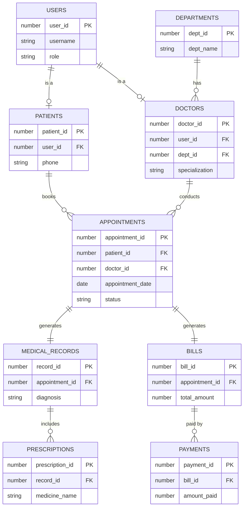

# Assignment 1: Requirement Analysis & ER Diagram

## 1. Problem Statement
**Project Title**: Smart Healthcare Management System

### Description
The Smart Healthcare Management System is a comprehensive web-based application designed to streamline hospital operations. It manages patients, doctors, appointments, medical records, billing, and payments. The system aims to improve efficiency, reduce paperwork, and enhance the overall patient experience.

### Key Features
- **User Roles**: Supports multiple roles (Admin, Doctor, Patient) with secure authentication.
- **Patient Management**: Registration, profile management, and medical history tracking.
- **Doctor Management**: Doctor profiles, specialization, and availability tracking.
- **Appointment Scheduling**: Patients can book, view, and cancel appointments.
- **Medical Records**: Doctors can record diagnoses, symptoms, and notes for each visit.
- **Prescriptions**: Digital prescriptions linked to medical records.
- **Billing & Payments**: Automated bill generation and payment tracking.
- **Audit Logging**: Tracks changes to critical patient data for security.

## 2. Requirement Analysis

### Functional Requirements
1.  **User Authentication**:
    -   Users must be able to register and login.
    -   Role-based access control (RBAC) for Admin, Doctor, and Patient.
2.  **Doctor Management**:
    -   Admins can add and manage doctor details.
    -   Doctors belong to specific departments.
3.  **Patient Services**:
    -   Patients can search for doctors by specialization.
    -   Patients can book appointments based on doctor availability.
4.  **Clinical Operations**:
    -   Doctors can view their appointment schedule.
    -   Doctors can add medical records and prescriptions for appointments.
5.  **Financial Operations**:
    -   System generates bills based on consultation fees and other charges.
    -   Support for multiple payment methods (Cash, Card, UPI, Insurance).

### Non-Functional Requirements
-   **Security**: Passwords must be hashed; sensitive data should be protected.
-   **Data Integrity**: Referential integrity must be maintained (e.g., an appointment must link to a valid patient and doctor).
-   **Availability**: The system should be available 24/7.
-   **Scalability**: The database should handle growing data for patients and records.

## 3. Entities and Attributes

| Entity | Attributes | Description |
| :--- | :--- | :--- |
| **USERS** | `user_id`, `username`, `password_hash`, `email`, `role`, `status` | Stores login credentials and roles for all users. |
| **DEPARTMENTS** | `dept_id`, `dept_name`, `description`, `location` | Hospital departments (e.g., Cardiology). |
| **DOCTORS** | `doctor_id`, `user_id`, `dept_id`, `first_name`, `last_name`, `specialization`, `fee` | Details of doctors, linked to Users and Departments. |
| **PATIENTS** | `patient_id`, `user_id`, `first_name`, `last_name`, `dob`, `phone`, `address` | Patient personal and contact details. |
| **APPOINTMENTS** | `appointment_id`, `patient_id`, `doctor_id`, `date`, `time`, `status` | Schedule of visits between patients and doctors. |
| **MEDICAL_RECORDS** | `record_id`, `appointment_id`, `diagnosis`, `symptoms`, `notes` | Clinical details recorded during an appointment. |
| **PRESCRIPTIONS** | `prescription_id`, `record_id`, `medicine_name`, `dosage`, `frequency` | Medicines prescribed by the doctor. |
| **BILLS** | `bill_id`, `appointment_id`, `total_amount`, `status`, `bill_date` | Invoice details for appointments. |
| **PAYMENTS** | `payment_id`, `bill_id`, `amount_paid`, `payment_method`, `date` | Payment transactions for bills. |

## 4. Entity-Relationship (ER) Diagram

