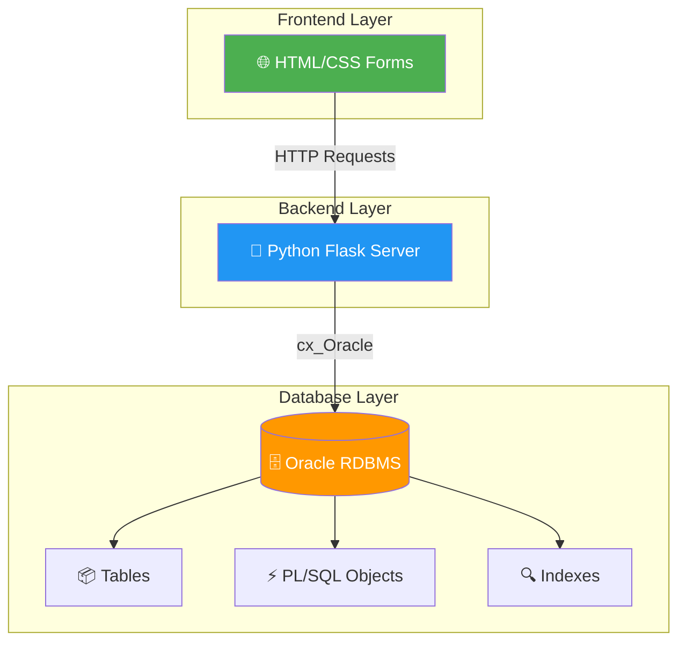
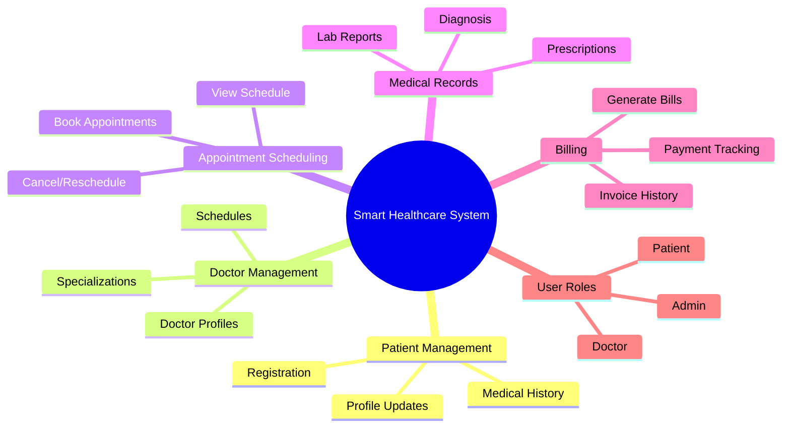

# 📋 Project Overview - Smart Healthcare Management System

## 🎯 Objective

A comprehensive **Database Management System (DBMS)** course project demonstrating core database concepts including ER modeling, normalization, SQL, PL/SQL, transactions, and application integration.

---

## 🏗️ System Architecture



---

## 🏥 System Modules



---

## 📊 Module Details

| Module | Key Features | Database Tables |
|--------|--------------|-----------------|
| **Patient Management** | Registration, profile updates, history | `PATIENTS`, `USERS` |
| **Doctor Management** | Profiles, specializations, availability | `DOCTORS`, `DEPARTMENTS` |
| **Appointment Scheduling** | Book, cancel, view appointments | `APPOINTMENTS` |
| **Medical Records** | Diagnosis, prescriptions, reports | `MEDICAL_RECORDS`, `PRESCRIPTIONS` |
| **Billing** | Bill generation, payments | `BILLS`, `PAYMENTS` |
| **User Roles** | Access control per role | `USERS` (role column) |

---

## 🛠️ Technology Stack

| Layer | Technology | Purpose |
|-------|------------|---------|
| **Database** | Oracle RDBMS | Data storage, SQL, PL/SQL |
| **Backend** | Python Flask | HTTP handling, DB connectivity |
| **Frontend** | HTML + CSS | User interface |
| **DB Driver** | cx_Oracle | Python-Oracle bridge |

---

## 📚 DBMS Syllabus Mapping

| DBMS Topic | Project Coverage |
|------------|------------------|
| ER Modeling | `02_ER_Diagram.md` |
| EER (Specialization) | `03_Extended_ER_Diagram.md` |
| Relational Model | `04_Relational_Schema.md` |
| Normalization | `05_Normalization.md` |
| Functional Dependencies | `06_Functional_Dependencies.md` |
| Relational Algebra | `07_Relational_Algebra.md` |
| SQL (DDL, DML, Joins) | `08_SQL_Queries.md` |
| PL/SQL | `09_PLSQL_Objects.md` |
| Transactions & ACID | `10_Transactions_and_ACID.md` |
| Indexing | `11_Indexing_and_Query_Optimization.md` |
| Distributed DB | `12_Distributed_Database_Concepts.md` |

---

## 📁 Project File Structure

```
smart-healthcare-system/
├── docs/                  # 15 Documentation files
├── sql/                   # SQL & PL/SQL scripts
│   ├── 01_create_tables.sql
│   ├── 02_insert_data.sql
│   └── 03_plsql_objects.sql
├── templates/             # HTML templates
├── static/                # CSS files
├── app.py                 # Flask backend
└── workhuman.md           # Oracle setup guide
```

---

## ✅ Learning Outcomes

After completing this project, you will understand:

1. **Database Design** - ER diagrams to relational schemas
2. **Normalization** - Eliminating redundancy (1NF → BCNF)
3. **SQL Mastery** - DDL, DML, complex queries
4. **PL/SQL Programming** - Procedures, functions, triggers
5. **Transaction Management** - ACID properties, concurrency
6. **Application Integration** - Connecting frontend to database

---

> **📝 Note:** This project focuses on **database concepts first**. The UI/backend are minimal, serving only to demonstrate database integration.
