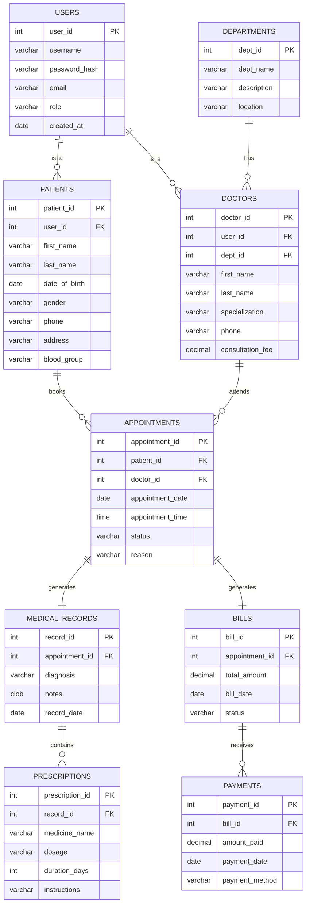
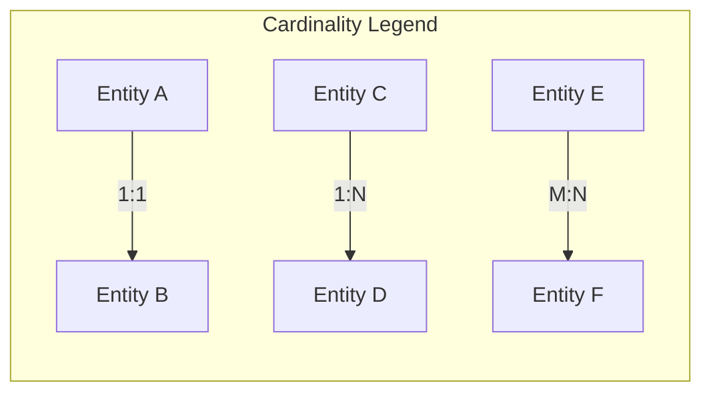

# 📐 Entity-Relationship (ER) Diagram

## 🎯 What is an ER Diagram?

An **Entity-Relationship Diagram** visually represents:
- **Entities** (real-world objects/concepts)
- **Attributes** (properties of entities)
- **Relationships** (associations between entities)

---

## 🗺️ Complete ER Diagram

---

## 📋 Entity Details

### 1️⃣ USERS (Base Entity)

| Attribute | Type | Constraint | Description |
|-----------|------|------------|-------------|
| `user_id` | INT | **PK** | Unique user identifier |
| `username` | VARCHAR(50) | UNIQUE, NOT NULL | Login username |
| `password_hash` | VARCHAR(255) | NOT NULL | Encrypted password |
| `email` | VARCHAR(100) | UNIQUE | User email |
| `role` | VARCHAR(20) | NOT NULL | 'ADMIN', 'DOCTOR', 'PATIENT' |
| `created_at` | DATE | DEFAULT SYSDATE | Account creation date |

---

### 2️⃣ PATIENTS

| Attribute | Type | Constraint | Description |
|-----------|------|------------|-------------|
| `patient_id` | INT | **PK** | Unique patient identifier |
| `user_id` | INT | **FK** → USERS | Links to user account |
| `first_name` | VARCHAR(50) | NOT NULL | Patient first name |
| `last_name` | VARCHAR(50) | NOT NULL | Patient last name |
| `date_of_birth` | DATE | NOT NULL | Birth date |
| `gender` | VARCHAR(10) | CHECK | 'Male', 'Female', 'Other' |
| `phone` | VARCHAR(15) | NOT NULL | Contact number |
| `address` | VARCHAR(200) | | Residential address |
| `blood_group` | VARCHAR(5) | | A+, B+, O-, etc. |

---

### 3️⃣ DEPARTMENTS

| Attribute | Type | Constraint | Description |
|-----------|------|------------|-------------|
| `dept_id` | INT | **PK** | Department identifier |
| `dept_name` | VARCHAR(50) | UNIQUE, NOT NULL | Department name |
| `description` | VARCHAR(200) | | About the department |
| `location` | VARCHAR(50) | | Building/Floor info |

---

### 4️⃣ DOCTORS

| Attribute | Type | Constraint | Description |
|-----------|------|------------|-------------|
| `doctor_id` | INT | **PK** | Unique doctor identifier |
| `user_id` | INT | **FK** → USERS | Links to user account |
| `dept_id` | INT | **FK** → DEPARTMENTS | Department association |
| `first_name` | VARCHAR(50) | NOT NULL | Doctor first name |
| `last_name` | VARCHAR(50) | NOT NULL | Doctor last name |
| `specialization` | VARCHAR(100) | NOT NULL | Medical specialty |
| `phone` | VARCHAR(15) | NOT NULL | Contact number |
| `consultation_fee` | DECIMAL(10,2) | NOT NULL | Fee per visit |

---

### 5️⃣ APPOINTMENTS

| Attribute | Type | Constraint | Description |
|-----------|------|------------|-------------|
| `appointment_id` | INT | **PK** | Unique appointment ID |
| `patient_id` | INT | **FK** → PATIENTS | Patient booking |
| `doctor_id` | INT | **FK** → DOCTORS | Assigned doctor |
| `appointment_date` | DATE | NOT NULL | Scheduled date |
| `appointment_time` | TIMESTAMP | NOT NULL | Scheduled time |
| `status` | VARCHAR(20) | DEFAULT 'SCHEDULED' | 'SCHEDULED', 'COMPLETED', 'CANCELLED' |
| `reason` | VARCHAR(200) | | Visit reason |

---

### 6️⃣ MEDICAL_RECORDS

| Attribute | Type | Constraint | Description |
|-----------|------|------------|-------------|
| `record_id` | INT | **PK** | Record identifier |
| `appointment_id` | INT | **FK** → APPOINTMENTS | Related appointment |
| `diagnosis` | VARCHAR(500) | | Doctor's diagnosis |
| `notes` | CLOB | | Detailed notes |
| `record_date` | DATE | DEFAULT SYSDATE | Record creation date |

---

### 7️⃣ PRESCRIPTIONS

| Attribute | Type | Constraint | Description |
|-----------|------|------------|-------------|
| `prescription_id` | INT | **PK** | Prescription ID |
| `record_id` | INT | **FK** → MEDICAL_RECORDS | Parent record |
| `medicine_name` | VARCHAR(100) | NOT NULL | Medicine name |
| `dosage` | VARCHAR(50) | | e.g., "500mg" |
| `duration_days` | INT | | Treatment duration |
| `instructions` | VARCHAR(200) | | How to take |

---

### 8️⃣ BILLS

| Attribute | Type | Constraint | Description |
|-----------|------|------------|-------------|
| `bill_id` | INT | **PK** | Bill identifier |
| `appointment_id` | INT | **FK** → APPOINTMENTS | Related appointment |
| `total_amount` | DECIMAL(10,2) | NOT NULL | Total bill amount |
| `bill_date` | DATE | DEFAULT SYSDATE | Bill generation date |
| `status` | VARCHAR(20) | | 'PENDING', 'PAID', 'PARTIAL' |

---

### 9️⃣ PAYMENTS

| Attribute | Type | Constraint | Description |
|-----------|------|------------|-------------|
| `payment_id` | INT | **PK** | Payment identifier |
| `bill_id` | INT | **FK** → BILLS | Related bill |
| `amount_paid` | DECIMAL(10,2) | NOT NULL | Payment amount |
| `payment_date` | DATE | DEFAULT SYSDATE | When paid |
| `payment_method` | VARCHAR(20) | | 'CASH', 'CARD', 'UPI' |

---

## 🔗 Relationship Summary

| Relationship | Type | Description |
|--------------|------|-------------|
| USERS → PATIENTS | 1:1 | One user can be one patient |
| USERS → DOCTORS | 1:1 | One user can be one doctor |
| DEPARTMENTS → DOCTORS | 1:N | One dept has many doctors |
| PATIENTS → APPOINTMENTS | 1:N | One patient, many appointments |
| DOCTORS → APPOINTMENTS | 1:N | One doctor, many appointments |
| APPOINTMENTS → MEDICAL_RECORDS | 1:1 | One appointment, one record |
| MEDICAL_RECORDS → PRESCRIPTIONS | 1:N | One record, many prescriptions |
| APPOINTMENTS → BILLS | 1:1 | One appointment, one bill |
| BILLS → PAYMENTS | 1:N | One bill, multiple payments |

---

## 🔑 Key Types Used

| Key Type | Symbol | Example |
|----------|--------|---------|
| **Primary Key (PK)** | 🔑 | `user_id`, `patient_id` |
| **Foreign Key (FK)** | 🔗 | `patient_id` in APPOINTMENTS |
| **Candidate Key** | ✨ | `email` in USERS |
| **Composite Key** | 🔐 | (patient_id, doctor_id, appointment_date) |

---

> **📝 DBMS Concept:** An ER diagram is the first step in database design. It captures real-world requirements before converting to a relational schema.
