# 📐 Extended Entity-Relationship (EER) Diagram

## 🎯 What is an EER Diagram?

An **Extended ER Diagram** builds upon the basic ER model by adding:
- **Specialization** (top-down: superclass → subclasses)
- **Generalization** (bottom-up: subclasses → superclass)
- **Inheritance** (subclasses inherit attributes from superclass)
- **Constraints** (disjoint/overlapping, total/partial)

---

## 🏗️ Specialization Hierarchy

```mermaid
graph TB
    subgraph "GENERALIZATION/SPECIALIZATION"
        USER["🧑 USER<br/>(Superclass)"]
        USER --> |"d, total"| SPEC{{"Specialization"}}
        SPEC --> ADMIN["👨‍💼 ADMIN<br/>(Subclass)"]
        SPEC --> DOCTOR["👨‍⚕️ DOCTOR<br/>(Subclass)"]
        SPEC --> PATIENT["🤒 PATIENT<br/>(Subclass)"]
    end
    
    style USER fill:#9C27B0,color:#fff
    style ADMIN fill:#4CAF50,color:#fff
    style DOCTOR fill:#2196F3,color:#fff
    style PATIENT fill:#FF9800,color:#fff
    style SPEC fill:#E91E63,color:#fff
```



---

## 📊 Detailed EER Structure


---

## 📋 Specialization Concepts

### 🔹 Superclass: USERS

The **USERS** entity is the superclass containing common attributes shared by all user types.

| Attribute | Description | Inherited By |
|-----------|-------------|--------------|
| `user_id` | Unique identifier | All subclasses |
| `username` | Login credential | All subclasses |
| `password_hash` | Security | All subclasses |
| `email` | Contact info | All subclasses |
| `role` | Discriminator | Determines subclass |
| `created_at` | Audit trail | All subclasses |

---

### 🔹 Subclass 1: ADMINS

**Specific attributes** (not in superclass):

| Attribute | Type | Description |
|-----------|------|-------------|
| `admin_id` | INT | Admin-specific PK |
| `admin_level` | VARCHAR | 'SUPER', 'REGULAR' |
| `permissions` | VARCHAR | Access rights (JSON/CSV) |
| `assigned_date` | DATE | When made admin |

**Inherited from USERS:** user_id, username, password_hash, email, created_at

---

### 🔹 Subclass 2: DOCTORS

**Specific attributes:**

| Attribute | Type | Description |
|-----------|------|-------------|
| `doctor_id` | INT | Doctor-specific PK |
| `specialization` | VARCHAR | Medical specialty |
| `license_number` | VARCHAR | Medical license |
| `experience_years` | INT | Years of practice |
| `consultation_fee` | DECIMAL | Per-visit charge |

---

### 🔹 Subclass 3: PATIENTS

**Specific attributes:**

| Attribute | Type | Description |
|-----------|------|-------------|
| `patient_id` | INT | Patient-specific PK |
| `date_of_birth` | DATE | For age calculation |
| `gender` | VARCHAR | Medical relevance |
| `blood_group` | VARCHAR | Emergency info |
| `emergency_contact` | VARCHAR | Contact in emergencies |

---

## 🔐 Specialization Constraints


### Our System Uses: **Disjoint + Total**

| Constraint | Value | Meaning |
|------------|-------|---------|
| **Disjointness** | Disjoint (d) | A user is EXACTLY ONE type |
| **Completeness** | Total | EVERY user MUST be a subtype |

---

## 🔄 Attribute Inheritance Flow

```mermaid
flowchart TD
    subgraph "Superclass Attributes"
        U1[user_id]
        U2[username]
        U3[password_hash]
        U4[email]
        U5[role]
    end
    
    subgraph "Admin Inherits + Adds"
        A1[user_id ↓]
        A2[admin_level]
        A3[permissions]
    end
    
    subgraph "Doctor Inherits + Adds"
        D1[user_id ↓]
        D2[specialization]
        D3[license_number]
        D4[consultation_fee]
    end
    
    subgraph "Patient Inherits + Adds"
        P1[user_id ↓]
        P2[date_of_birth]
        P3[blood_group]
        P4[emergency_contact]
    end
    
    U1 --> A1
    U1 --> D1
    U1 --> P1
```



---

## 💾 Implementation in Oracle

### Option 1: Single Table with Discriminator (Used Here)

```sql
-- Superclass table with role as discriminator
CREATE TABLE USERS (
    user_id NUMBER PRIMARY KEY,
    username VARCHAR2(50) UNIQUE NOT NULL,
    password_hash VARCHAR2(255) NOT NULL,
    email VARCHAR2(100) UNIQUE,
    role VARCHAR2(20) NOT NULL CHECK (role IN ('ADMIN', 'DOCTOR', 'PATIENT')),
    created_at DATE DEFAULT SYSDATE
);

-- Subclass tables reference superclass
CREATE TABLE DOCTORS (
    doctor_id NUMBER PRIMARY KEY,
    user_id NUMBER UNIQUE REFERENCES USERS(user_id),
    specialization VARCHAR2(100),
    license_number VARCHAR2(50) UNIQUE,
    consultation_fee NUMBER(10,2)
);
```

### Option 2: Complete Subclass Tables (Alternative)

Each subclass table contains ALL attributes (inherited + specific). Useful when subclasses are rarely queried together.

---

## 📊 Comparison: ER vs EER

| Feature | Basic ER | Extended ER (EER) |
|---------|----------|-------------------|
| Entities | ✅ | ✅ |
| Relationships | ✅ | ✅ |
| Attributes | ✅ | ✅ |
| Specialization | ❌ | ✅ |
| Generalization | ❌ | ✅ |
| Inheritance | ❌ | ✅ |
| Constraints (d/o, total/partial) | ❌ | ✅ |

---

## 🎓 Viva Quick Points

1. **Specialization** = Top-down approach (divide superclass into subclasses)
2. **Generalization** = Bottom-up approach (combine subclasses into superclass)
3. **Disjoint** = Entity belongs to AT MOST one subclass
4. **Overlapping** = Entity can belong to MULTIPLE subclasses
5. **Total** = Every superclass entity MUST belong to a subclass
6. **Partial** = Some superclass entities may NOT belong to any subclass

---

> **📝 DBMS Concept:** EER diagrams are essential for modeling complex real-world scenarios with inheritance hierarchies, making the jump from conceptual design to implementation smoother.
