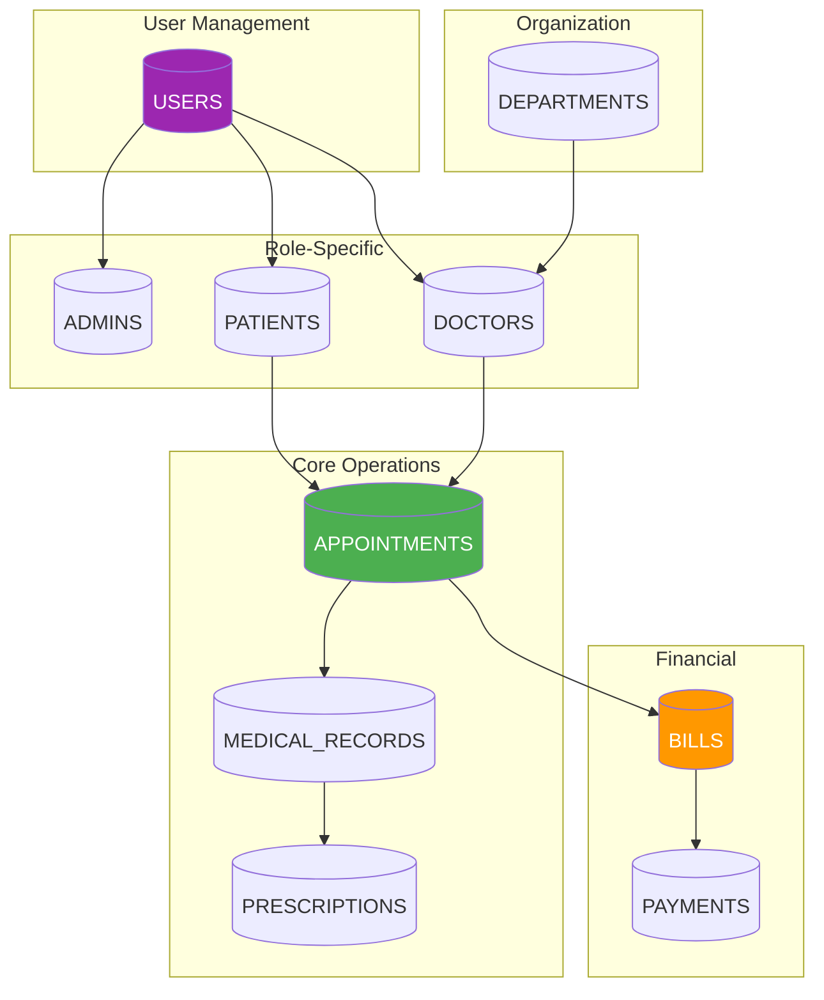
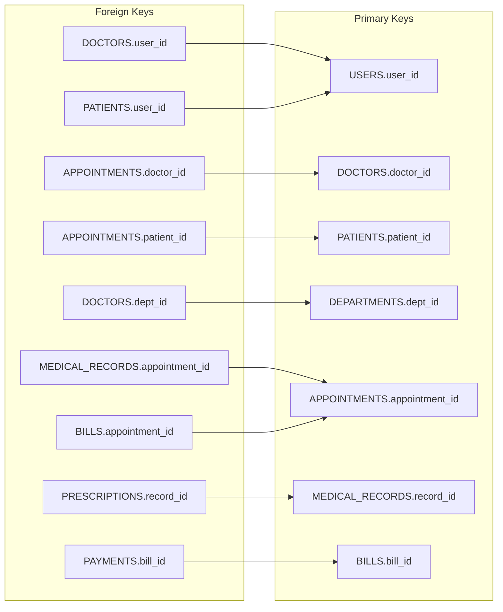

# 📊 Relational Schema

## 🎯 What is a Relational Schema?

A **Relational Schema** is the logical blueprint of a database, showing:
- **Tables** (Relations)
- **Columns** (Attributes)
- **Primary Keys** (PK)
- **Foreign Keys** (FK)
- **Constraints** (NOT NULL, UNIQUE, CHECK, DEFAULT)

---

## 🗺️ Schema Overview



---

## 📋 Complete Schema Definitions

### Table 1: USERS

```
USERS (
    user_id         : NUMBER          [PK]
    username        : VARCHAR2(50)    [UNIQUE, NOT NULL]
    password_hash   : VARCHAR2(255)   [NOT NULL]
    email           : VARCHAR2(100)   [UNIQUE]
    role            : VARCHAR2(20)    [NOT NULL, CHECK IN ('ADMIN','DOCTOR','PATIENT')]
    status          : VARCHAR2(20)    [DEFAULT 'ACTIVE']
    created_at      : DATE            [DEFAULT SYSDATE]
)
```

**Constraints:**
- PK: `user_id`
- UNIQUE: `username`, `email`
- CHECK: `role` must be 'ADMIN', 'DOCTOR', or 'PATIENT'

---

### Table 2: DEPARTMENTS

```
DEPARTMENTS (
    dept_id         : NUMBER          [PK]
    dept_name       : VARCHAR2(50)    [UNIQUE, NOT NULL]
    description     : VARCHAR2(200)
    location        : VARCHAR2(50)
    head_doctor_id  : NUMBER          [FK → DOCTORS]
)
```

**Constraints:**
- PK: `dept_id`
- FK: `head_doctor_id` REFERENCES `DOCTORS(doctor_id)`

---

### Table 3: DOCTORS

```
DOCTORS (
    doctor_id       : NUMBER          [PK]
    user_id         : NUMBER          [FK → USERS, UNIQUE]
    dept_id         : NUMBER          [FK → DEPARTMENTS]
    first_name      : VARCHAR2(50)    [NOT NULL]
    last_name       : VARCHAR2(50)    [NOT NULL]
    specialization  : VARCHAR2(100)   [NOT NULL]
    license_number  : VARCHAR2(50)    [UNIQUE]
    phone           : VARCHAR2(15)    [NOT NULL]
    experience_years: NUMBER
    consultation_fee: NUMBER(10,2)    [NOT NULL]
    available       : CHAR(1)         [DEFAULT 'Y', CHECK IN ('Y','N')]
)
```

---

### Table 4: PATIENTS

```
PATIENTS (
    patient_id      : NUMBER          [PK]
    user_id         : NUMBER          [FK → USERS, UNIQUE]
    first_name      : VARCHAR2(50)    [NOT NULL]
    last_name       : VARCHAR2(50)    [NOT NULL]
    date_of_birth   : DATE            [NOT NULL]
    gender          : VARCHAR2(10)    [CHECK IN ('Male','Female','Other')]
    phone           : VARCHAR2(15)    [NOT NULL]
    address         : VARCHAR2(200)
    city            : VARCHAR2(50)
    blood_group     : VARCHAR2(5)
    emergency_contact: VARCHAR2(15)
    registered_date : DATE            [DEFAULT SYSDATE]
)
```

---

### Table 5: APPOINTMENTS

```
APPOINTMENTS (
    appointment_id  : NUMBER          [PK]
    patient_id      : NUMBER          [FK → PATIENTS, NOT NULL]
    doctor_id       : NUMBER          [FK → DOCTORS, NOT NULL]
    appointment_date: DATE            [NOT NULL]
    appointment_time: VARCHAR2(10)    [NOT NULL]
    status          : VARCHAR2(20)    [DEFAULT 'SCHEDULED']
    reason          : VARCHAR2(500)
    created_at      : DATE            [DEFAULT SYSDATE]
)
```

**Status Values:** 'SCHEDULED', 'COMPLETED', 'CANCELLED', 'NO_SHOW'

---

### Table 6: MEDICAL_RECORDS

```
MEDICAL_RECORDS (
    record_id       : NUMBER          [PK]
    appointment_id  : NUMBER          [FK → APPOINTMENTS, UNIQUE]
    patient_id      : NUMBER          [FK → PATIENTS]
    doctor_id       : NUMBER          [FK → DOCTORS]
    diagnosis       : VARCHAR2(500)
    symptoms        : VARCHAR2(500)
    notes           : CLOB
    record_date     : DATE            [DEFAULT SYSDATE]
)
```

---

### Table 7: PRESCRIPTIONS

```
PRESCRIPTIONS (
    prescription_id : NUMBER          [PK]
    record_id       : NUMBER          [FK → MEDICAL_RECORDS, NOT NULL]
    medicine_name   : VARCHAR2(100)   [NOT NULL]
    dosage          : VARCHAR2(50)
    frequency       : VARCHAR2(50)
    duration_days   : NUMBER
    instructions    : VARCHAR2(200)
)
```

---

### Table 8: BILLS

```
BILLS (
    bill_id         : NUMBER          [PK]
    appointment_id  : NUMBER          [FK → APPOINTMENTS, UNIQUE]
    patient_id      : NUMBER          [FK → PATIENTS]
    consultation_fee: NUMBER(10,2)
    medicine_fee    : NUMBER(10,2)    [DEFAULT 0]
    lab_fee         : NUMBER(10,2)    [DEFAULT 0]
    total_amount    : NUMBER(10,2)    [NOT NULL]
    discount        : NUMBER(5,2)     [DEFAULT 0]
    final_amount    : NUMBER(10,2)
    bill_date       : DATE            [DEFAULT SYSDATE]
    status          : VARCHAR2(20)    [DEFAULT 'PENDING']
)
```

---

### Table 9: PAYMENTS

```
PAYMENTS (
    payment_id      : NUMBER          [PK]
    bill_id         : NUMBER          [FK → BILLS, NOT NULL]
    amount_paid     : NUMBER(10,2)    [NOT NULL]
    payment_date    : DATE            [DEFAULT SYSDATE]
    payment_method  : VARCHAR2(20)    [CHECK IN ('CASH','CARD','UPI','INSURANCE')]
    transaction_ref : VARCHAR2(50)
)
```

---

## 🔗 Foreign Key Relationships Diagram



---

## 📊 Schema Summary Table

| Table | PK | Foreign Keys | Key Relationships |
|-------|-----|--------------|-------------------|
| **USERS** | user_id | - | Base table |
| **DEPARTMENTS** | dept_id | head_doctor_id → DOCTORS | 1:N with DOCTORS |
| **DOCTORS** | doctor_id | user_id → USERS, dept_id → DEPARTMENTS | Extends USERS |
| **PATIENTS** | patient_id | user_id → USERS | Extends USERS |
| **APPOINTMENTS** | appointment_id | patient_id → PATIENTS, doctor_id → DOCTORS | Junction table |
| **MEDICAL_RECORDS** | record_id | appointment_id → APPOINTMENTS | 1:1 with APPOINTMENTS |
| **PRESCRIPTIONS** | prescription_id | record_id → MEDICAL_RECORDS | N:1 with RECORDS |
| **BILLS** | bill_id | appointment_id → APPOINTMENTS | 1:1 with APPOINTMENTS |
| **PAYMENTS** | payment_id | bill_id → BILLS | N:1 with BILLS |

---

## 🔑 Key Symbol Legend

| Symbol | Meaning |
|--------|---------|
| **PK** | Primary Key |
| **FK** | Foreign Key |
| **UK** | Unique Key |
| **NN** | NOT NULL |
| **CK** | CHECK Constraint |
| **DF** | DEFAULT Value |

---

> **📝 DBMS Concept:** The relational schema is derived from the ER diagram through a process called "ER-to-Relational Mapping." Each entity becomes a table, attributes become columns, and relationships become foreign keys.
