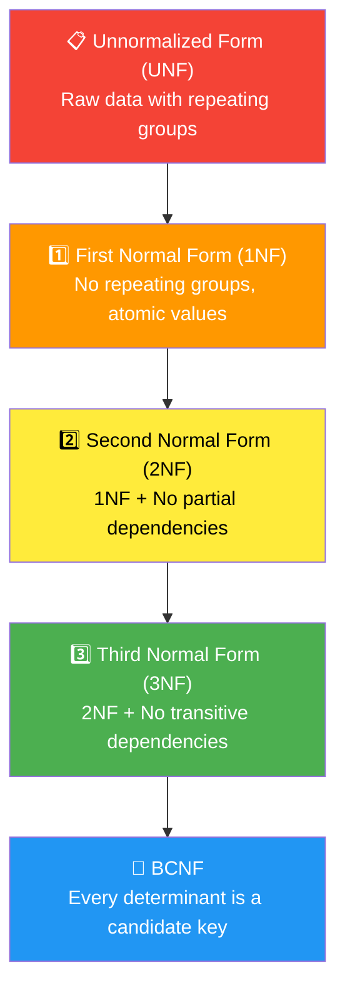

# 📐 Normalization

## 🎯 What is Normalization?

**Normalization** is the process of organizing data to:
- ✅ Eliminate **redundancy** (duplicate data)
- ✅ Prevent **anomalies** (insert, update, delete issues)
- ✅ Ensure **data integrity**

---

## 📊 Normal Forms Hierarchy



---

## 📝 Example: APPOINTMENTS Table Normalization

### ❌ Unnormalized Form (UNF)

```
APPOINTMENT_DATA (
    appointment_id, patient_name, patient_phone, patient_address,
    doctor_name, doctor_phone, dept_name, dept_location,
    appointment_date, medicines_prescribed, bill_amount
)
```

**Problems:**
- `medicines_prescribed` contains multiple values (not atomic)
- Patient info repeated for each appointment
- Doctor info repeated
- Department info repeated

---

### ✅ First Normal Form (1NF)

**Rule:** All attributes must contain **atomic (indivisible) values**. No repeating groups.

```
APPOINTMENTS_1NF (
    appointment_id [PK],
    patient_name,
    patient_phone,
    patient_address,
    doctor_name,
    doctor_phone,
    dept_name,
    dept_location,
    appointment_date,
    medicine_1,        -- Separated
    medicine_2,        -- Separated  
    bill_amount
)
```

**Better approach - separate table for medicines:**

```
APPOINTMENTS_1NF (
    appointment_id [PK], patient_name, patient_phone, ..., appointment_date
)

PRESCRIBED_MEDICINES (
    prescription_id [PK], appointment_id [FK], medicine_name, dosage
)
```

✅ **1NF Achieved:** No multi-valued attributes

---

### ✅ Second Normal Form (2NF)

**Rule:** Must be in 1NF + No **partial dependencies** (non-key attributes must depend on the **entire** primary key)

**Before 2NF (if composite key):**

```
APPOINTMENT_DETAILS (
    patient_id [PK], doctor_id [PK], appointment_date [PK],
    patient_name,    -- Depends only on patient_id (PARTIAL)
    patient_phone,   -- Depends only on patient_id (PARTIAL)
    doctor_name,     -- Depends only on doctor_id (PARTIAL)
    dept_name,       -- Depends only on doctor_id (PARTIAL)
    status
)
```

**Partial Dependencies Found:**
- `patient_name` → depends on `patient_id` only
- `doctor_name` → depends on `doctor_id` only

**After 2NF (decomposition):**

```
PATIENTS (
    patient_id [PK],
    patient_name,
    patient_phone
)

DOCTORS (
    doctor_id [PK],
    doctor_name,
    dept_name
)

APPOINTMENTS (
    appointment_id [PK],
    patient_id [FK],
    doctor_id [FK],
    appointment_date,
    status
)
```

✅ **2NF Achieved:** No partial dependencies

---

### ✅ Third Normal Form (3NF)

**Rule:** Must be in 2NF + No **transitive dependencies** (non-key → non-key dependencies)

**Before 3NF:**

```
DOCTORS (
    doctor_id [PK],
    doctor_name,
    dept_id,
    dept_name,      -- Depends on dept_id, NOT doctor_id (TRANSITIVE)
    dept_location   -- Depends on dept_id, NOT doctor_id (TRANSITIVE)
)
```

**Transitive Dependency:**
- `doctor_id` → `dept_id` → `dept_name`
- `dept_name` transitively depends on `doctor_id`

**After 3NF:**

```
DOCTORS (
    doctor_id [PK],
    doctor_name,
    dept_id [FK]
)

DEPARTMENTS (
    dept_id [PK],
    dept_name,
    dept_location
)
```

✅ **3NF Achieved:** No transitive dependencies

---

## 🎯 BCNF (Boyce-Codd Normal Form)

**Rule:** For every functional dependency X → Y, X must be a **superkey**

**Example Issue:**

```
DOCTOR_SCHEDULE (
    doctor_id [PK],
    day [PK],
    room_number,
    department
)
```

If: `room_number → department` (room determines department)

But `room_number` is NOT a key, so BCNF is violated.

**Solution:** Decompose

```
DOCTOR_SCHEDULE (
    doctor_id [PK],
    day [PK],
    room_number [FK]
)

ROOMS (
    room_number [PK],
    department
)
```

---

## 📊 Our Schema - Normalization Status


| Table | 1NF | 2NF | 3NF | BCNF |
|-------|-----|-----|-----|------|
| USERS | ✅ | ✅ | ✅ | ✅ |
| PATIENTS | ✅ | ✅ | ✅ | ✅ |
| DOCTORS | ✅ | ✅ | ✅ | ✅ |
| DEPARTMENTS | ✅ | ✅ | ✅ | ✅ |
| APPOINTMENTS | ✅ | ✅ | ✅ | ✅ |
| MEDICAL_RECORDS | ✅ | ✅ | ✅ | ✅ |
| PRESCRIPTIONS | ✅ | ✅ | ✅ | ✅ |
| BILLS | ✅ | ✅ | ✅ | ✅ |
| PAYMENTS | ✅ | ✅ | ✅ | ✅ |

---

## ⚠️ Anomalies Prevented

| Anomaly Type | Problem | How Normalization Fixes |
|--------------|---------|-------------------------|
| **Insert Anomaly** | Can't add department without a doctor | Separate DEPARTMENTS table |
| **Update Anomaly** | Changing dept name needs multiple updates | Single update in DEPARTMENTS |
| **Delete Anomaly** | Deleting last doctor deletes dept info | Department exists independently |

---

## 🎓 Quick Reference

| Normal Form | Key Rule | Easy Check |
|-------------|----------|------------|
| **1NF** | Atomic values | No comma-separated values |
| **2NF** | Full dependency on PK | No partial dependencies |
| **3NF** | No transitive dependencies | Non-key shouldn't determine non-key |
| **BCNF** | Every determinant is a key | Stricter version of 3NF |

---

> **📝 DBMS Concept:** Normalization trades off some query performance (more JOINs) for data integrity and reduced redundancy. In practice, most databases normalize to 3NF or BCNF.
