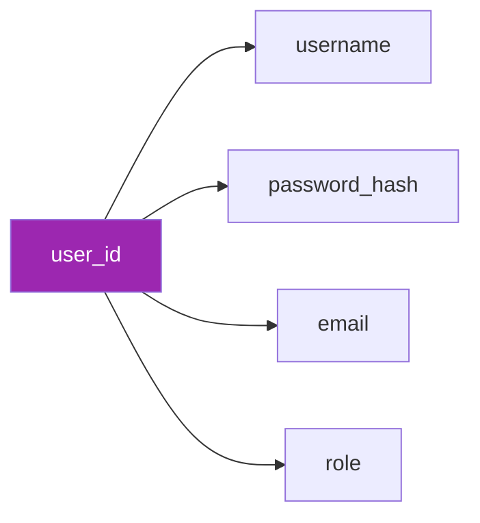
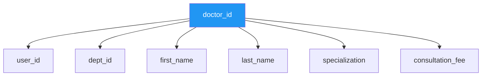
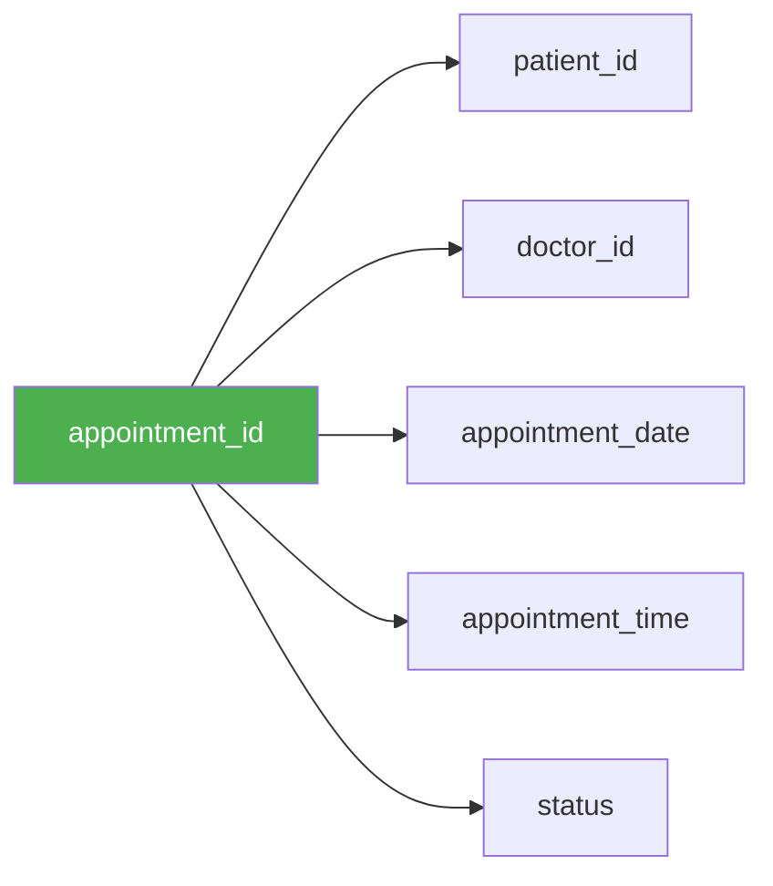
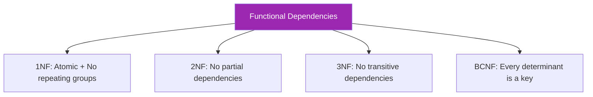

# 🔗 Functional Dependencies

## 🎯 What is a Functional Dependency?

A **Functional Dependency (FD)** X → Y means:
- If two tuples have the same value for X, they **must** have the same value for Y
- X **determines** Y (Y is functionally dependent on X)

---

## 📊 FD Notation


| Symbol | Meaning |
|--------|---------|
| X → Y | X determines Y |
| X → Y, Z | X determines both Y and Z |
| X, Y → Z | Composite (X and Y together) determine Z |

---

## 📋 Functional Dependencies by Table

### 1️⃣ USERS

```
FDs:
    user_id → username, password_hash, email, role, status, created_at
    username → user_id, password_hash, email, role, status, created_at
    email → user_id, username, password_hash, role, status, created_at
```

**Candidate Keys:** `{user_id}`, `{username}`, `{email}`



---

### 2️⃣ DEPARTMENTS

```
FDs:
    dept_id → dept_name, description, location, head_doctor_id
    dept_name → dept_id, description, location, head_doctor_id
```

**Candidate Keys:** `{dept_id}`, `{dept_name}`

---

### 3️⃣ DOCTORS

```
FDs:
    doctor_id → user_id, dept_id, first_name, last_name, specialization, 
                license_number, phone, experience_years, consultation_fee
    user_id → doctor_id, dept_id, first_name, last_name, ...
    license_number → doctor_id, user_id, ...
```

**Candidate Keys:** `{doctor_id}`, `{user_id}`, `{license_number}`



---

### 4️⃣ PATIENTS

```
FDs:
    patient_id → user_id, first_name, last_name, date_of_birth, gender,
                 phone, address, city, blood_group, emergency_contact
    user_id → patient_id, first_name, last_name, ...
```

**Candidate Keys:** `{patient_id}`, `{user_id}`

---

### 5️⃣ APPOINTMENTS

```
FDs:
    appointment_id → patient_id, doctor_id, appointment_date, 
                     appointment_time, status, reason, created_at
    
    (patient_id, doctor_id, appointment_date, appointment_time) → 
                     appointment_id, status, reason
```

**Primary Key:** `{appointment_id}`
**Alternate Composite Key:** `{patient_id, doctor_id, appointment_date, appointment_time}`



---

### 6️⃣ MEDICAL_RECORDS

```
FDs:
    record_id → appointment_id, patient_id, doctor_id, diagnosis, 
                symptoms, notes, record_date
    appointment_id → record_id, patient_id, doctor_id, diagnosis, ...
```

**Candidate Keys:** `{record_id}`, `{appointment_id}` (1:1 relationship)

---

### 7️⃣ PRESCRIPTIONS

```
FDs:
    prescription_id → record_id, medicine_name, dosage, frequency,
                      duration_days, instructions
```

**Primary Key:** `{prescription_id}`

---

### 8️⃣ BILLS

```
FDs:
    bill_id → appointment_id, patient_id, consultation_fee, medicine_fee,
              lab_fee, total_amount, discount, final_amount, bill_date, status
    appointment_id → bill_id, patient_id, ...
```

**Candidate Keys:** `{bill_id}`, `{appointment_id}`

---

### 9️⃣ PAYMENTS

```
FDs:
    payment_id → bill_id, amount_paid, payment_date, payment_method,
                 transaction_ref
```

**Primary Key:** `{payment_id}`

---

## 📊 FD Summary Table

| Table | Primary Key | Candidate Keys | Key FDs |
|-------|-------------|----------------|---------|
| USERS | user_id | username, email | user_id → all |
| DEPARTMENTS | dept_id | dept_name | dept_id → all |
| DOCTORS | doctor_id | user_id, license_number | doctor_id → all |
| PATIENTS | patient_id | user_id | patient_id → all |
| APPOINTMENTS | appointment_id | (patient, doctor, date, time) | appointment_id → all |
| MEDICAL_RECORDS | record_id | appointment_id | record_id → all |
| PRESCRIPTIONS | prescription_id | - | prescription_id → all |
| BILLS | bill_id | appointment_id | bill_id → all |
| PAYMENTS | payment_id | - | payment_id → all |

---

## 🔄 Armstrong's Axioms

Used to derive new FDs from existing ones:

| Axiom | Rule | Example |
|-------|------|---------|
| **Reflexivity** | If Y ⊆ X, then X → Y | {A, B} → A |
| **Augmentation** | If X → Y, then XZ → YZ | If A → B, then AC → BC |
| **Transitivity** | If X → Y and Y → Z, then X → Z | If A → B and B → C, then A → C |

**Derived Rules:**

| Rule | Formula |
|------|---------|
| **Union** | If X → Y and X → Z, then X → YZ |
| **Decomposition** | If X → YZ, then X → Y and X → Z |
| **Pseudo-transitivity** | If X → Y and WY → Z, then WX → Z |

---

## 🎓 FD & Normal Forms Connection



| Normal Form | FD Requirement |
|-------------|----------------|
| **2NF** | No non-prime attribute partially depends on candidate key |
| **3NF** | No non-prime attribute transitively depends on candidate key |
| **BCNF** | For X → Y, X must be a superkey |

---

> **📝 DBMS Concept:** Functional dependencies are the foundation of normalization. They help identify the appropriate normal form and guide database schema design.
