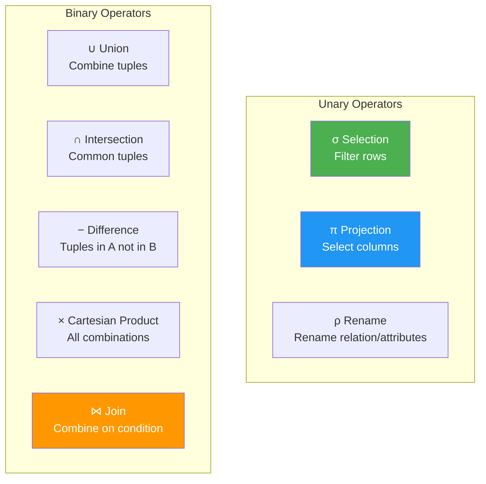
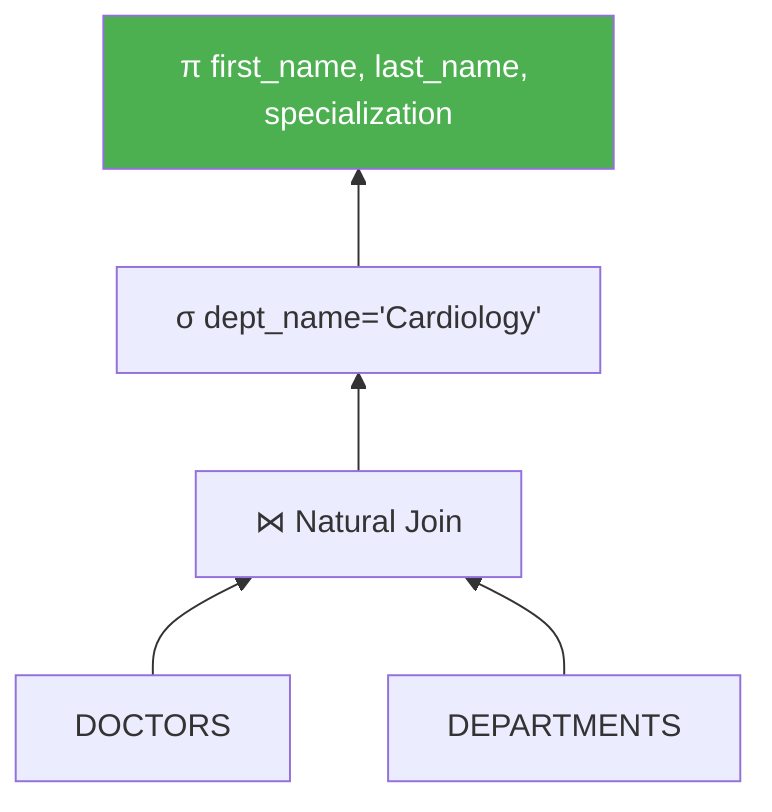
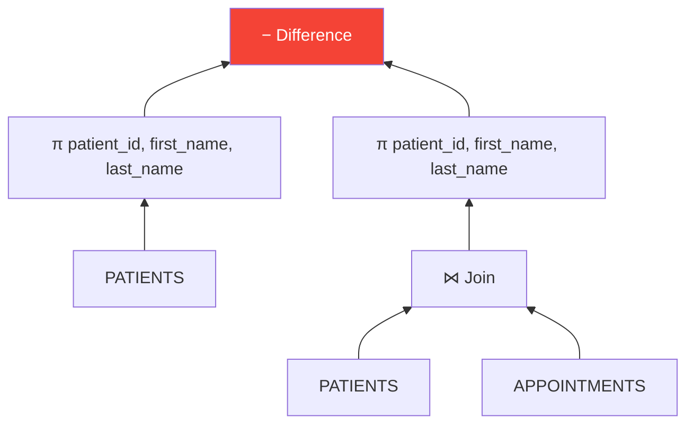
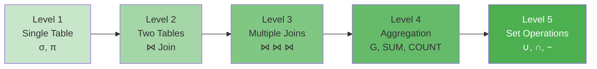

# ➗ Relational Algebra

## 🎯 What is Relational Algebra?

**Relational Algebra** is a procedural query language that:
- Uses **operators** to retrieve data from relations
- Forms the **theoretical foundation** of SQL
- Provides a step-by-step approach to query execution

---

## 📊 Basic Operators



---

## 📋 Operator Reference

| Operator | Symbol | Purpose | SQL Equivalent |
|----------|--------|---------|----------------|
| Selection | σ | Filter rows | WHERE |
| Projection | π | Select columns | SELECT (column list) |
| Rename | ρ | Rename | AS |
| Union | ∪ | Combine results | UNION |
| Intersection | ∩ | Common tuples | INTERSECT |
| Difference | − | Subtract tuples | EXCEPT/MINUS |
| Cartesian Product | × | Cross product | CROSS JOIN |
| Natural Join | ⋈ | Join on common attrs | NATURAL JOIN |
| Theta Join | ⋈θ | Join with condition | JOIN ON |

---

## 🏥 Healthcare System Queries in Relational Algebra

### Query 1: Get all scheduled appointments

**Natural Language:** Find all appointments with status 'SCHEDULED'

**Relational Algebra:**
```
σ status='SCHEDULED' (APPOINTMENTS)
```

**SQL Equivalent:**
```sql
SELECT * FROM APPOINTMENTS WHERE status = 'SCHEDULED';
```

---

### Query 2: Get patient names and phone numbers

**Natural Language:** List only names and phones of all patients

**Relational Algebra:**
```
π first_name, last_name, phone (PATIENTS)
```

**SQL Equivalent:**
```sql
SELECT first_name, last_name, phone FROM PATIENTS;
```

---

### Query 3: Doctors in Cardiology department

**Natural Language:** Find doctors who work in Cardiology

**Relational Algebra:**
```
π first_name, last_name, specialization (
    σ dept_name='Cardiology' (DOCTORS ⋈ DEPARTMENTS)
)
```

**Execution Tree:**


---

### Query 4: Appointments with patient and doctor names

**Natural Language:** Show appointment details with patient and doctor names

**Relational Algebra:**
```
π patient_name, doctor_name, appointment_date, status (
    ρ patient_name ← first_name (PATIENTS) 
    ⋈ APPOINTMENTS 
    ⋈ ρ doctor_name ← first_name (DOCTORS)
)
```

**SQL Equivalent:**
```sql
SELECT p.first_name AS patient_name, 
       d.first_name AS doctor_name,
       a.appointment_date, 
       a.status
FROM APPOINTMENTS a
JOIN PATIENTS p ON a.patient_id = p.patient_id
JOIN DOCTORS d ON a.doctor_id = d.doctor_id;
```

---

### Query 5: Patients who have never had an appointment

**Natural Language:** Find patients with no appointments

**Relational Algebra:**
```
π patient_id, first_name, last_name (PATIENTS) 
− 
π patient_id, first_name, last_name (PATIENTS ⋈ APPOINTMENTS)
```

**Execution Tree:**


---

### Query 6: Total bill amount per patient

**Natural Language:** Calculate total billing for each patient

**Relational Algebra:**
```
patient_id G SUM(total_amount) (BILLS)
```

Where G represents **Grouping/Aggregation**

**SQL Equivalent:**
```sql
SELECT patient_id, SUM(total_amount) 
FROM BILLS 
GROUP BY patient_id;
```

---

### Query 7: Doctors with consultation fee > 500

**Natural Language:** Find doctors charging more than 500

**Relational Algebra:**
```
π doctor_id, first_name, last_name, consultation_fee (
    σ consultation_fee > 500 (DOCTORS)
)
```

---

### Query 8: Patients with pending bills

**Natural Language:** Find patients who have unpaid bills

**Relational Algebra:**
```
π patient_id, first_name, last_name (
    PATIENTS ⋈ (σ status='PENDING' (BILLS))
)
```

---

### Query 9: Appointments in January 2024

**Natural Language:** Find all appointments in a specific month

**Relational Algebra:**
```
σ appointment_date >= '2024-01-01' AND appointment_date <= '2024-01-31' (APPOINTMENTS)
```

---

### Query 10: Union - All Doctors and Patients (Names)

**Natural Language:** Combined list of all doctor and patient names

**Relational Algebra:**
```
π first_name, last_name (DOCTORS) ∪ π first_name, last_name (PATIENTS)
```

---

## 📊 Query Complexity Progression



---

## 🔗 Relational Algebra to SQL Mapping

| Relational Algebra | SQL |
|-------------------|-----|
| σ condition (R) | SELECT * FROM R WHERE condition |
| π a1, a2 (R) | SELECT a1, a2 FROM R |
| R ⋈ S | SELECT * FROM R NATURAL JOIN S |
| R ⋈ R.a=S.b S | SELECT * FROM R JOIN S ON R.a = S.b |
| R ∪ S | SELECT * FROM R UNION SELECT * FROM S |
| R ∩ S | SELECT * FROM R INTERSECT SELECT * FROM S |
| R − S | SELECT * FROM R MINUS SELECT * FROM S |
| R × S | SELECT * FROM R CROSS JOIN S |

---

## 🎓 Viva Quick Points

1. **Relational Algebra is procedural** - specifies HOW to get results
2. **SQL is declarative** - specifies WHAT results you want
3. **Selection (σ)** operates on rows, **Projection (π)** operates on columns
4. **Join** combines tables based on related columns
5. **Natural Join** automatically matches columns with same name

---

> **📝 DBMS Concept:** Relational algebra provides the theoretical foundation for query optimization. The database query optimizer converts SQL to relational algebra expressions and reorders operations for efficiency.
