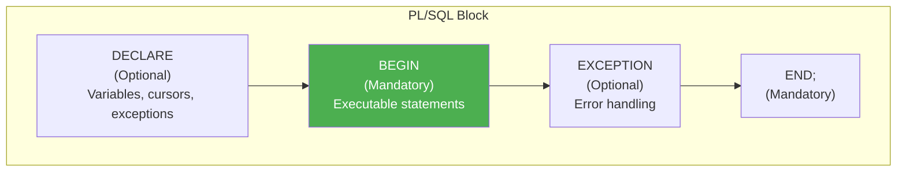
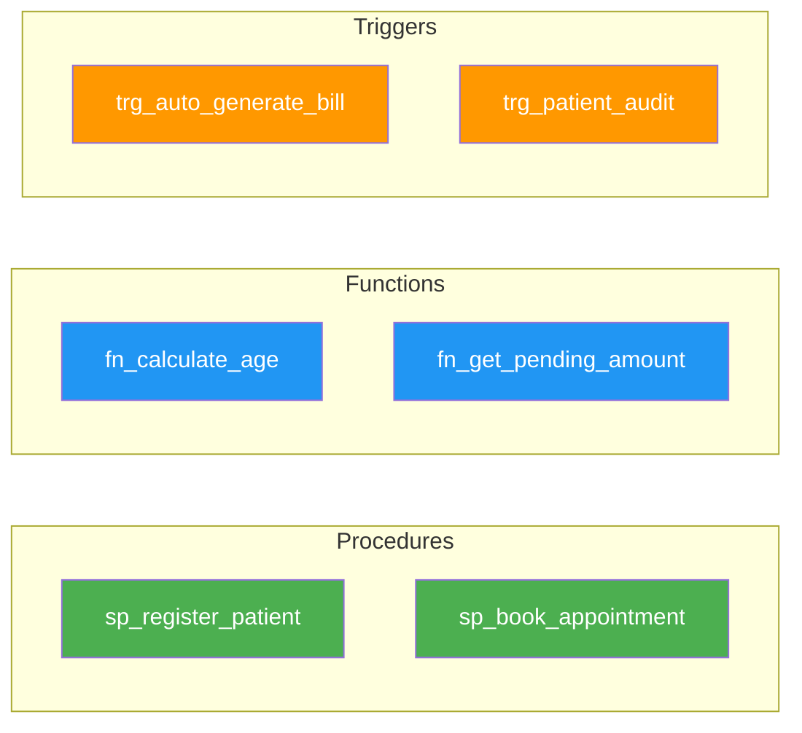

# ⚡ PL/SQL Objects

## 🎯 What is PL/SQL?

**PL/SQL** (Procedural Language/SQL) is Oracle's extension to SQL that provides:
- **Procedural constructs** (loops, conditionals)
- **Error handling** (exceptions)
- **Reusable code** (procedures, functions, packages)
- **Database triggers** (automatic actions)

---

## 📊 PL/SQL Block Structure



---

## 🔧 Procedure 1: Register New Patient

### Purpose
Automates patient registration by:
1. Creating user account
2. Creating patient record
3. Handling errors with rollback

### Code

```sql
CREATE OR REPLACE PROCEDURE sp_register_patient (
    p_username      IN VARCHAR2,
    p_password      IN VARCHAR2,
    p_email         IN VARCHAR2,
    p_first_name    IN VARCHAR2,
    p_last_name     IN VARCHAR2,
    p_dob           IN DATE,
    p_gender        IN VARCHAR2,
    p_phone         IN VARCHAR2,
    p_address       IN VARCHAR2,
    p_city          IN VARCHAR2,
    p_blood_group   IN VARCHAR2,
    p_result        OUT VARCHAR2
)
AS
    v_user_id       NUMBER;
    v_patient_id    NUMBER;
BEGIN
    -- Step 1: Create user account
    INSERT INTO USERS (user_id, username, password_hash, email, role, status)
    VALUES (user_seq.NEXTVAL, p_username, p_password, p_email, 'PATIENT', 'ACTIVE')
    RETURNING user_id INTO v_user_id;
    
    -- Step 2: Create patient record
    INSERT INTO PATIENTS (
        patient_id, user_id, first_name, last_name, date_of_birth,
        gender, phone, address, city, blood_group
    )
    VALUES (
        patient_seq.NEXTVAL, v_user_id, p_first_name, p_last_name, p_dob,
        p_gender, p_phone, p_address, p_city, p_blood_group
    )
    RETURNING patient_id INTO v_patient_id;
    
    -- Commit transaction
    COMMIT;
    
    p_result := 'SUCCESS: Patient registered with ID ' || v_patient_id;
    
EXCEPTION
    WHEN DUP_VAL_ON_INDEX THEN
        ROLLBACK;
        p_result := 'ERROR: Username or email already exists';
    WHEN OTHERS THEN
        ROLLBACK;
        p_result := 'ERROR: ' || SQLERRM;
END sp_register_patient;
/
```

### Usage Example

```sql
DECLARE
    v_result VARCHAR2(200);
BEGIN
    sp_register_patient(
        p_username    => 'john_doe',
        p_password    => 'hashed_password123',
        p_email       => 'john@email.com',
        p_first_name  => 'John',
        p_last_name   => 'Doe',
        p_dob         => TO_DATE('1995-03-20', 'YYYY-MM-DD'),
        p_gender      => 'Male',
        p_phone       => '9876543210',
        p_address     => '100 Oak Street',
        p_city        => 'Pune',
        p_blood_group => 'O+',
        p_result      => v_result
    );
    DBMS_OUTPUT.PUT_LINE(v_result);
END;
/
```

---

## 🔧 Procedure 2: Book Appointment

### Purpose
Books an appointment with validation:
1. Checks doctor availability
2. Prevents double booking
3. Creates appointment record

### Code

```sql
CREATE OR REPLACE PROCEDURE sp_book_appointment (
    p_patient_id    IN NUMBER,
    p_doctor_id     IN NUMBER,
    p_apt_date      IN DATE,
    p_apt_time      IN VARCHAR2,
    p_reason        IN VARCHAR2,
    p_result        OUT VARCHAR2
)
AS
    v_doctor_available  CHAR(1);
    v_existing_count    NUMBER;
    v_appointment_id    NUMBER;
BEGIN
    -- Validation 1: Check if doctor is available (general availability)
    SELECT available INTO v_doctor_available
    FROM DOCTORS WHERE doctor_id = p_doctor_id;
    
    IF v_doctor_available = 'N' THEN
        p_result := 'ERROR: Doctor is not available';
        RETURN;
    END IF;
    
    -- Validation 2: Check for time slot conflict
    SELECT COUNT(*) INTO v_existing_count
    FROM APPOINTMENTS
    WHERE doctor_id = p_doctor_id
      AND appointment_date = p_apt_date
      AND appointment_time = p_apt_time
      AND status != 'CANCELLED';
    
    IF v_existing_count > 0 THEN
        p_result := 'ERROR: Time slot already booked';
        RETURN;
    END IF;
    
    -- Create appointment
    INSERT INTO APPOINTMENTS (
        appointment_id, patient_id, doctor_id, 
        appointment_date, appointment_time, status, reason
    )
    VALUES (
        appointment_seq.NEXTVAL, p_patient_id, p_doctor_id,
        p_apt_date, p_apt_time, 'SCHEDULED', p_reason
    )
    RETURNING appointment_id INTO v_appointment_id;
    
    COMMIT;
    p_result := 'SUCCESS: Appointment booked with ID ' || v_appointment_id;
    
EXCEPTION
    WHEN NO_DATA_FOUND THEN
        p_result := 'ERROR: Doctor not found';
    WHEN OTHERS THEN
        ROLLBACK;
        p_result := 'ERROR: ' || SQLERRM;
END sp_book_appointment;
/
```

---

## 📐 Function 1: Calculate Patient Age

### Purpose
Returns patient's age based on date of birth.

### Code

```sql
CREATE OR REPLACE FUNCTION fn_calculate_age (
    p_patient_id IN NUMBER
) RETURN NUMBER
AS
    v_dob   DATE;
    v_age   NUMBER;
BEGIN
    SELECT date_of_birth INTO v_dob
    FROM PATIENTS
    WHERE patient_id = p_patient_id;
    
    -- Calculate age in years
    v_age := FLOOR(MONTHS_BETWEEN(SYSDATE, v_dob) / 12);
    
    RETURN v_age;
    
EXCEPTION
    WHEN NO_DATA_FOUND THEN
        RETURN -1; -- Patient not found
    WHEN OTHERS THEN
        RETURN -2; -- Error occurred
END fn_calculate_age;
/
```

### Usage Example

```sql
-- Use in SELECT
SELECT 
    patient_id,
    first_name,
    last_name,
    fn_calculate_age(patient_id) AS age
FROM PATIENTS;

-- Use in PL/SQL
DECLARE
    v_age NUMBER;
BEGIN
    v_age := fn_calculate_age(1);
    DBMS_OUTPUT.PUT_LINE('Patient age: ' || v_age);
END;
/
```

---

## 📐 Function 2: Get Total Bill Amount

### Purpose
Calculates total unpaid bill amount for a patient.

### Code

```sql
CREATE OR REPLACE FUNCTION fn_get_pending_amount (
    p_patient_id IN NUMBER
) RETURN NUMBER
AS
    v_total_pending NUMBER := 0;
BEGIN
    SELECT NVL(SUM(final_amount), 0) INTO v_total_pending
    FROM BILLS
    WHERE patient_id = p_patient_id
      AND status IN ('PENDING', 'PARTIAL');
    
    RETURN v_total_pending;
    
EXCEPTION
    WHEN OTHERS THEN
        RETURN 0;
END fn_get_pending_amount;
/
```

---

## ⚡ Trigger 1: Auto-Generate Bill After Appointment Completion

### Purpose
When appointment status changes to 'COMPLETED':
1. Automatically creates a bill record
2. Calculates consultation fee from doctor's rate

### Code

```sql
CREATE OR REPLACE TRIGGER trg_auto_generate_bill
AFTER UPDATE OF status ON APPOINTMENTS
FOR EACH ROW
WHEN (NEW.status = 'COMPLETED' AND OLD.status != 'COMPLETED')
DECLARE
    v_consultation_fee  NUMBER(10,2);
    v_bill_exists       NUMBER;
BEGIN
    -- Check if bill already exists
    SELECT COUNT(*) INTO v_bill_exists
    FROM BILLS WHERE appointment_id = :NEW.appointment_id;
    
    IF v_bill_exists = 0 THEN
        -- Get doctor's consultation fee
        SELECT consultation_fee INTO v_consultation_fee
        FROM DOCTORS WHERE doctor_id = :NEW.doctor_id;
        
        -- Create bill
        INSERT INTO BILLS (
            bill_id, appointment_id, patient_id,
            consultation_fee, total_amount, final_amount, status
        )
        VALUES (
            bill_seq.NEXTVAL, :NEW.appointment_id, :NEW.patient_id,
            v_consultation_fee, v_consultation_fee, v_consultation_fee, 'PENDING'
        );
    END IF;
    
EXCEPTION
    WHEN OTHERS THEN
        -- Log error (in production, use proper error logging)
        DBMS_OUTPUT.PUT_LINE('Error in trigger: ' || SQLERRM);
END;
/
```

---

## ⚡ Trigger 2: Audit Trail for Patient Updates

### Purpose
Logs all changes to patient records for audit purposes.

### Setup Audit Table

```sql
CREATE TABLE PATIENT_AUDIT_LOG (
    log_id          NUMBER PRIMARY KEY,
    patient_id      NUMBER,
    action          VARCHAR2(10),
    changed_by      VARCHAR2(50),
    change_date     DATE DEFAULT SYSDATE,
    old_phone       VARCHAR2(15),
    new_phone       VARCHAR2(15),
    old_address     VARCHAR2(200),
    new_address     VARCHAR2(200)
);

CREATE SEQUENCE audit_log_seq START WITH 1;
```

### Trigger Code

```sql
CREATE OR REPLACE TRIGGER trg_patient_audit
AFTER UPDATE ON PATIENTS
FOR EACH ROW
BEGIN
    INSERT INTO PATIENT_AUDIT_LOG (
        log_id, patient_id, action, changed_by,
        old_phone, new_phone, old_address, new_address
    )
    VALUES (
        audit_log_seq.NEXTVAL, :OLD.patient_id, 'UPDATE', USER,
        :OLD.phone, :NEW.phone, :OLD.address, :NEW.address
    );
END;
/
```

---

## 📊 PL/SQL Objects Summary



| Object Type | Name | Purpose |
|-------------|------|---------|
| **Procedure** | sp_register_patient | Register new patient with user account |
| **Procedure** | sp_book_appointment | Book appointment with validation |
| **Function** | fn_calculate_age | Calculate patient's age |
| **Function** | fn_get_pending_amount | Get unpaid bill amount |
| **Trigger** | trg_auto_generate_bill | Auto-create bill on appointment completion |
| **Trigger** | trg_patient_audit | Audit log for patient updates |

---

## 🎓 Key Differences

| Procedure | Function |
|-----------|----------|
| May or may not return value | Must return exactly one value |
| Uses OUT parameters | Uses RETURN statement |
| Cannot be used in SELECT | Can be used in SELECT |
| Performs actions | Computes and returns values |

---

> **📝 DBMS Concept:** PL/SQL enables business logic to be stored in the database, ensuring data integrity, reducing network traffic, and providing code reusability.
