# 🔄 Transactions and ACID Properties

## 🎯 What is a Transaction?

A **Transaction** is a logical unit of work that:
- Contains one or more SQL statements
- Either **completes entirely** (COMMIT) or **fails entirely** (ROLLBACK)
- Maintains database consistency

---

## 📊 ACID Properties


### 🔒 Atomicity

**Definition:** All operations in a transaction complete successfully, or none of them do.

**Example:**
```sql
-- Transfer appointment from one doctor to another
BEGIN
    UPDATE APPOINTMENTS SET doctor_id = 2 WHERE appointment_id = 1;
    UPDATE BILLS SET consultation_fee = 600 WHERE appointment_id = 1;
    -- If second UPDATE fails, first UPDATE should also be undone
    COMMIT;
EXCEPTION
    WHEN OTHERS THEN
        ROLLBACK; -- Undo all changes
END;
```

---

### ✅ Consistency

**Definition:** Transaction transforms database from one valid state to another valid state.

**Example:**
```sql
-- Consistency check: Total payments cannot exceed bill amount
DECLARE
    v_bill_amount NUMBER;
    v_total_paid  NUMBER;
BEGIN
    SELECT final_amount INTO v_bill_amount FROM BILLS WHERE bill_id = 1;
    SELECT NVL(SUM(amount_paid), 0) INTO v_total_paid FROM PAYMENTS WHERE bill_id = 1;
    
    -- Adding new payment
    IF (v_total_paid + 200) <= v_bill_amount THEN
        INSERT INTO PAYMENTS (payment_id, bill_id, amount_paid, payment_method)
        VALUES (payment_seq.NEXTVAL, 1, 200, 'CASH');
        COMMIT;
    ELSE
        RAISE_APPLICATION_ERROR(-20001, 'Payment exceeds bill amount');
    END IF;
END;
```

---

### 🔐 Isolation

**Definition:** Concurrent transactions don't interfere with each other.

**Isolation Levels:**

| Level | Dirty Read | Non-Repeatable Read | Phantom Read |
|-------|------------|---------------------|--------------|
| READ UNCOMMITTED | ✅ Possible | ✅ Possible | ✅ Possible |
| READ COMMITTED | ❌ Prevented | ✅ Possible | ✅ Possible |
| REPEATABLE READ | ❌ Prevented | ❌ Prevented | ✅ Possible |
| SERIALIZABLE | ❌ Prevented | ❌ Prevented | ❌ Prevented |

**Oracle Default:** READ COMMITTED

```sql
-- Set isolation level (session-level)
SET TRANSACTION ISOLATION LEVEL SERIALIZABLE;
```

---

### 💾 Durability

**Definition:** Once committed, changes persist even after system failure.

**How Oracle Ensures Durability:**
- Write-Ahead Logging (WAL)
- Redo logs written before data files
- Checkpoint mechanism

---

## 📋 Transaction Control Statements

### COMMIT

```sql
-- Permanently saves changes
BEGIN
    INSERT INTO PATIENTS (patient_id, first_name, last_name, date_of_birth, gender, phone)
    VALUES (patient_seq.NEXTVAL, 'Test', 'Patient', SYSDATE, 'Male', '9999999999');
    
    COMMIT; -- Changes are now permanent
END;
```

### ROLLBACK

```sql
-- Undoes all changes since last commit
BEGIN
    DELETE FROM APPOINTMENTS WHERE status = 'CANCELLED';
    -- Oops! Wrong condition
    ROLLBACK; -- Undo the delete
END;
```

### SAVEPOINT

```sql
-- Create checkpoints within transaction
BEGIN
    INSERT INTO DEPARTMENTS VALUES (dept_seq.NEXTVAL, 'New Dept 1', 'Desc 1', 'Loc 1');
    SAVEPOINT sp1;
    
    INSERT INTO DEPARTMENTS VALUES (dept_seq.NEXTVAL, 'New Dept 2', 'Desc 2', 'Loc 2');
    SAVEPOINT sp2;
    
    INSERT INTO DEPARTMENTS VALUES (dept_seq.NEXTVAL, 'New Dept 3', 'Desc 3', 'Loc 3');
    
    -- Rollback only to sp2 (keeps Dept 1 and Dept 2)
    ROLLBACK TO sp2;
    
    COMMIT; -- Only Dept 1 and Dept 2 are saved
END;
```

---

## 🏥 Healthcare System Transaction Examples

### Example 1: Complete Appointment Flow

```sql
-- Transaction: Complete appointment with bill and payment
CREATE OR REPLACE PROCEDURE sp_complete_appointment_flow (
    p_appointment_id    IN NUMBER,
    p_diagnosis         IN VARCHAR2,
    p_payment_amount    IN NUMBER,
    p_payment_method    IN VARCHAR2,
    p_result            OUT VARCHAR2
)
AS
    v_patient_id        NUMBER;
    v_doctor_id         NUMBER;
    v_consultation_fee  NUMBER;
    v_bill_id           NUMBER;
    v_record_id         NUMBER;
BEGIN
    -- SAVEPOINT for controlled rollback
    SAVEPOINT start_transaction;
    
    -- Step 1: Get appointment details
    SELECT patient_id, doctor_id INTO v_patient_id, v_doctor_id
    FROM APPOINTMENTS WHERE appointment_id = p_appointment_id;
    
    -- Step 2: Update appointment status
    UPDATE APPOINTMENTS
    SET status = 'COMPLETED'
    WHERE appointment_id = p_appointment_id;
    
    -- Step 3: Create medical record
    INSERT INTO MEDICAL_RECORDS (record_id, appointment_id, patient_id, doctor_id, diagnosis)
    VALUES (record_seq.NEXTVAL, p_appointment_id, v_patient_id, v_doctor_id, p_diagnosis)
    RETURNING record_id INTO v_record_id;
    
    -- Step 4: Get consultation fee
    SELECT consultation_fee INTO v_consultation_fee
    FROM DOCTORS WHERE doctor_id = v_doctor_id;
    
    -- Step 5: Create bill
    INSERT INTO BILLS (bill_id, appointment_id, patient_id, consultation_fee, total_amount, final_amount, status)
    VALUES (bill_seq.NEXTVAL, p_appointment_id, v_patient_id, v_consultation_fee, v_consultation_fee, v_consultation_fee, 'PENDING')
    RETURNING bill_id INTO v_bill_id;
    
    -- Step 6: Process payment
    INSERT INTO PAYMENTS (payment_id, bill_id, amount_paid, payment_method)
    VALUES (payment_seq.NEXTVAL, v_bill_id, p_payment_amount, p_payment_method);
    
    -- Step 7: Update bill status
    IF p_payment_amount >= v_consultation_fee THEN
        UPDATE BILLS SET status = 'PAID' WHERE bill_id = v_bill_id;
    ELSE
        UPDATE BILLS SET status = 'PARTIAL' WHERE bill_id = v_bill_id;
    END IF;
    
    -- All successful - COMMIT
    COMMIT;
    p_result := 'SUCCESS: Appointment completed, Bill ID: ' || v_bill_id;
    
EXCEPTION
    WHEN OTHERS THEN
        ROLLBACK TO start_transaction;
        p_result := 'ERROR: Transaction rolled back - ' || SQLERRM;
END;
/
```

### Example 2: Concurrent Booking Prevention

```sql
-- Prevent double booking using SELECT FOR UPDATE
CREATE OR REPLACE PROCEDURE sp_safe_book_appointment (
    p_patient_id    IN NUMBER,
    p_doctor_id     IN NUMBER,
    p_date          IN DATE,
    p_time          IN VARCHAR2,
    p_result        OUT VARCHAR2
)
AS
    v_slot_locked   NUMBER;
    RESOURCE_BUSY   EXCEPTION;
    PRAGMA EXCEPTION_INIT(RESOURCE_BUSY, -54);
BEGIN
    -- Lock the time slot row (prevent other transactions)
    SELECT COUNT(*) INTO v_slot_locked
    FROM APPOINTMENTS
    WHERE doctor_id = p_doctor_id
      AND appointment_date = p_date
      AND appointment_time = p_time
      AND status != 'CANCELLED'
    FOR UPDATE NOWAIT; -- Fails immediately if locked
    
    IF v_slot_locked > 0 THEN
        p_result := 'ERROR: Slot already booked';
        RETURN;
    END IF;
    
    -- Safe to insert
    INSERT INTO APPOINTMENTS (appointment_id, patient_id, doctor_id, appointment_date, appointment_time, status)
    VALUES (appointment_seq.NEXTVAL, p_patient_id, p_doctor_id, p_date, p_time, 'SCHEDULED');
    
    COMMIT;
    p_result := 'SUCCESS: Appointment booked';
    
EXCEPTION
    WHEN RESOURCE_BUSY THEN
        p_result := 'ERROR: Slot is being booked by another user. Try again.';
    WHEN OTHERS THEN
        ROLLBACK;
        p_result := 'ERROR: ' || SQLERRM;
END;
/
```

---

## 🔄 Transaction Flow Diagram


---

## 📊 Serializability

### What is Serializability?

A schedule of concurrent transactions is **serializable** if its result is equivalent to some serial execution of those transactions.

```mermaid
graph LR
    subgraph "Concurrent Execution"
        T1_1["T1: Read A"] --> T2_1["T2: Read A"]
        T2_1 --> T1_2["T1: Write A"]
        T1_2 --> T2_2["T2: Write A"]
    end
    
    subgraph "Serial Equivalent"
        S1["T1: Read A → Write A"] --> S2["T2: Read A → Write A"]
    end
```



### Types of Serializability

| Type | Definition |
|------|------------|
| **Conflict Serializability** | Reorder non-conflicting operations to get serial schedule |
| **View Serializability** | Same final values as some serial execution |

---

## 🎓 Viva Quick Points

1. **Transaction** = Logical unit of work (one or more SQL statements)
2. **ACID** = Atomicity, Consistency, Isolation, Durability
3. **COMMIT** = Make changes permanent
4. **ROLLBACK** = Undo changes
5. **SAVEPOINT** = Checkpoint within transaction
6. **Dirty Read** = Reading uncommitted data
7. **SELECT FOR UPDATE** = Lock rows to prevent concurrent modification

---

> **📝 DBMS Concept:** Transactions are fundamental to maintaining data integrity in multi-user database systems. The ACID properties ensure reliable processing even in the presence of failures.
