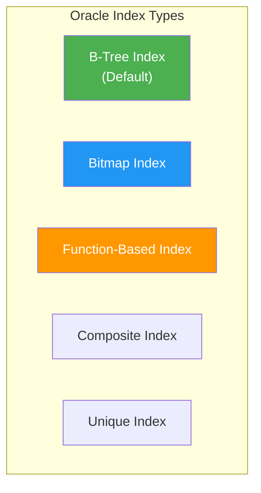
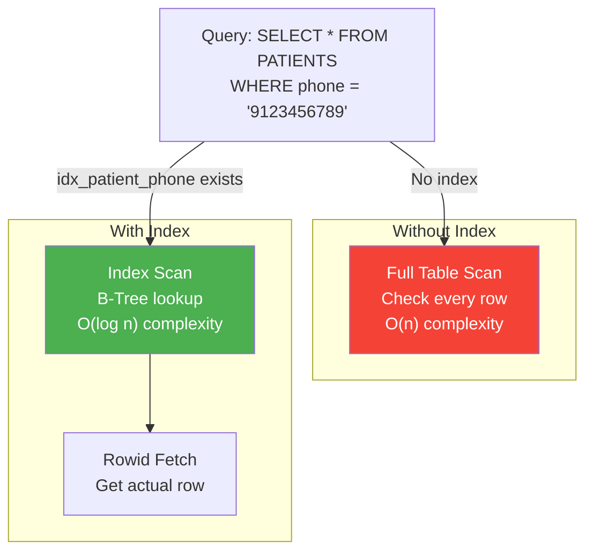
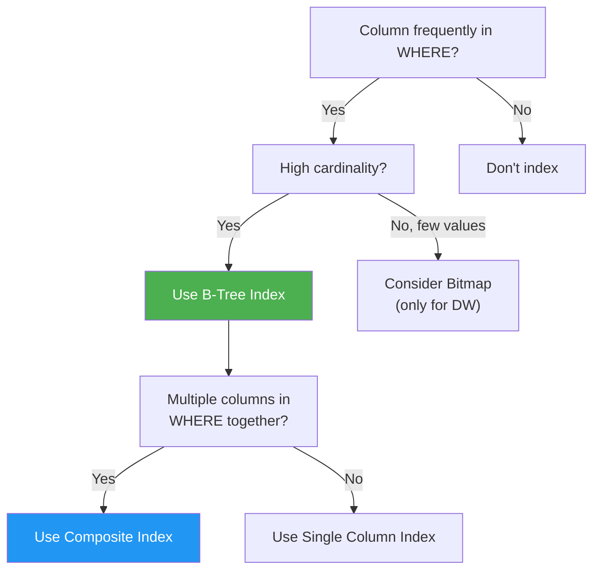

# 🔍 Indexing and Query Optimization

## 🎯 What is an Index?

An **Index** is a database object that:
- Speeds up data retrieval
- Works like a book's index - quick lookup without scanning every page
- Trade-off: Faster reads, slower writes (index maintenance)

---

## 📊 Index Types



---

## 📋 Index Types Comparison

| Index Type | Best For | Not Good For |
|------------|----------|--------------|
| **B-Tree** | High cardinality columns, range queries | Low cardinality |
| **Bitmap** | Low cardinality (few distinct values), data warehouses | OLTP, frequent updates |
| **Function-Based** | Queries with functions on columns | Simple equality checks |
| **Composite** | Multi-column WHERE clauses | Single column queries |
| **Unique** | Primary keys, unique constraints | Non-unique data |

---

## 🏥 Healthcare System Indexes

### 1. Primary Key Indexes (Auto-created)

```sql
-- These are created automatically with PRIMARY KEY constraints
-- USERS.user_id - PK Index
-- PATIENTS.patient_id - PK Index
-- DOCTORS.doctor_id - PK Index
-- APPOINTMENTS.appointment_id - PK Index
-- etc.
```

### 2. B-Tree Indexes for Frequent Lookups

```sql
-- Index on appointment date (frequently used in WHERE)
CREATE INDEX idx_appointment_date ON APPOINTMENTS(appointment_date);

-- Index on patient phone (for searching patients)
CREATE INDEX idx_patient_phone ON PATIENTS(phone);

-- Index on doctor specialization
CREATE INDEX idx_doctor_specialization ON DOCTORS(specialization);

-- Index on bill status (for pending bills query)
CREATE INDEX idx_bill_status ON BILLS(status);
```

### 3. Composite Indexes

```sql
-- Composite index for appointment lookup (doctor + date + time)
CREATE INDEX idx_appointment_slot 
ON APPOINTMENTS(doctor_id, appointment_date, appointment_time);

-- Composite index for patient search
CREATE INDEX idx_patient_name 
ON PATIENTS(last_name, first_name);
```

### 4. Bitmap Index (for low cardinality columns)

```sql
-- Bitmap index on appointment status (only 4 possible values)
CREATE BITMAP INDEX idx_appointment_status_bm 
ON APPOINTMENTS(status);

-- Bitmap index on gender
CREATE BITMAP INDEX idx_patient_gender_bm 
ON PATIENTS(gender);

-- Note: Use bitmap indexes only in data warehouse scenarios
-- Not recommended for OLTP due to locking overhead
```

### 5. Function-Based Index

```sql
-- Index for case-insensitive search
CREATE INDEX idx_patient_email_upper 
ON PATIENTS(UPPER(email));

-- Usage: This index is used when query has UPPER(email)
SELECT * FROM PATIENTS WHERE UPPER(email) = 'RAJ@EMAIL.COM';

-- Index on year of appointment
CREATE INDEX idx_appointment_year 
ON APPOINTMENTS(EXTRACT(YEAR FROM appointment_date));
```

---

## 📊 Index Workflow



---

## 🔧 Query Optimization Techniques

### 1. Use EXPLAIN PLAN

```sql
-- Analyze query execution plan
EXPLAIN PLAN FOR
SELECT p.first_name, p.last_name, a.appointment_date
FROM PATIENTS p
JOIN APPOINTMENTS a ON p.patient_id = a.patient_id
WHERE a.appointment_date >= SYSDATE;

-- View the plan
SELECT * FROM TABLE(DBMS_XPLAN.DISPLAY);
```

### 2. Analyze Tables for Statistics

```sql
-- Gather statistics for optimizer
BEGIN
    DBMS_STATS.GATHER_TABLE_STATS('HEALTHCARE', 'APPOINTMENTS');
    DBMS_STATS.GATHER_TABLE_STATS('HEALTHCARE', 'PATIENTS');
    DBMS_STATS.GATHER_TABLE_STATS('HEALTHCARE', 'DOCTORS');
END;
/

-- Gather for entire schema
BEGIN
    DBMS_STATS.GATHER_SCHEMA_STATS('HEALTHCARE');
END;
/
```

### 3. Query Optimization Examples

**Before (Slow):**
```sql
-- Full table scan on large table
SELECT * FROM APPOINTMENTS 
WHERE TO_CHAR(appointment_date, 'YYYY-MM') = '2024-02';
```

**After (Fast):**
```sql
-- Range scan using index
SELECT * FROM APPOINTMENTS 
WHERE appointment_date >= TO_DATE('2024-02-01', 'YYYY-MM-DD')
  AND appointment_date < TO_DATE('2024-03-01', 'YYYY-MM-DD');
```

---

### 4. Avoid Function on Indexed Column

**Bad (index not used):**
```sql
SELECT * FROM PATIENTS WHERE UPPER(first_name) = 'RAJ';
```

**Good (use function-based index or):**
```sql
-- Create function-based index first
CREATE INDEX idx_patient_fname_upper ON PATIENTS(UPPER(first_name));

-- Now query uses the index
SELECT * FROM PATIENTS WHERE UPPER(first_name) = 'RAJ';
```

---

### 5. Use Covering Indexes

```sql
-- If query only needs indexed columns, no table access needed
CREATE INDEX idx_patient_phone_name ON PATIENTS(phone, first_name, last_name);

-- This query can be satisfied from index alone
SELECT phone, first_name, last_name 
FROM PATIENTS 
WHERE phone = '9123456789';
```

---

## 📊 Index Selection Guidelines



---

## 📋 Index Do's and Don'ts

### ✅ Do:

| Practice | Reason |
|----------|--------|
| Index foreign keys | Speed up JOINs |
| Index WHERE clause columns | Faster filtering |
| Index ORDER BY columns | Faster sorting |
| Analyze tables regularly | Accurate optimizer decisions |

### ❌ Don't:

| Practice | Reason |
|----------|--------|
| Index every column | Slower INSERTs/UPDATEs |
| Index small tables | Full scan is faster |
| Use bitmap in OLTP | Lock contention |
| Index heavily updated columns | Index maintenance overhead |

---

## 📊 Index Monitoring

```sql
-- Check if indexes are being used
SELECT 
    index_name,
    table_name,
    blevel,        -- B-tree height
    leaf_blocks,   -- Number of leaf blocks
    distinct_keys, -- Number of distinct values
    clustering_factor
FROM USER_INDEXES
WHERE table_name = 'APPOINTMENTS';

-- Find unused indexes
SELECT 
    i.index_name,
    i.table_name,
    i.last_analyzed
FROM USER_INDEXES i
WHERE i.last_analyzed IS NOT NULL
ORDER BY i.last_analyzed;
```

---

## 🎓 Viva Quick Points

| Question | Answer |
|----------|--------|
| What is an index? | Data structure to speed up queries |
| Default index type in Oracle? | B-Tree |
| When to use Bitmap index? | Low cardinality, data warehouse |
| Does indexing slow down writes? | Yes, due to index maintenance |
| What is a composite index? | Index on multiple columns |
| What is a covering index? | Index containing all columns needed by query |

---

> **📝 DBMS Concept:** Indexes are crucial for query performance but come with storage and maintenance costs. Proper index design requires understanding query patterns and data distribution.
