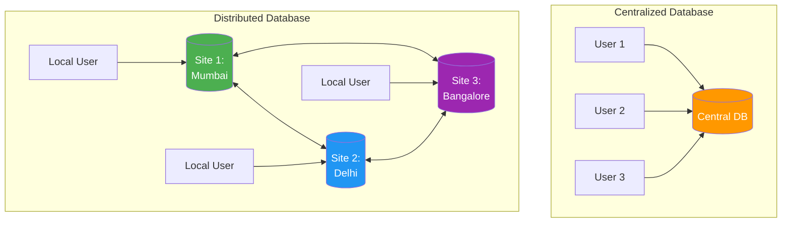
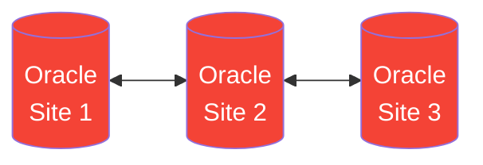
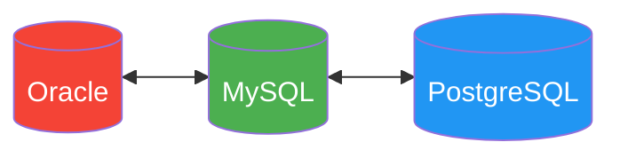
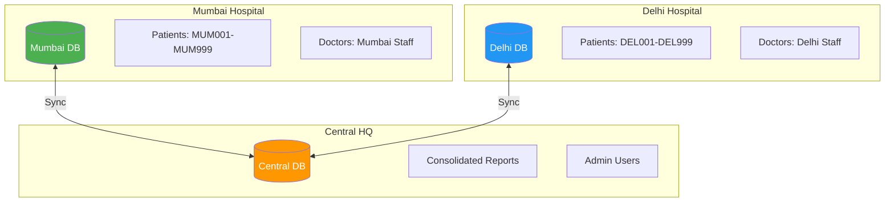
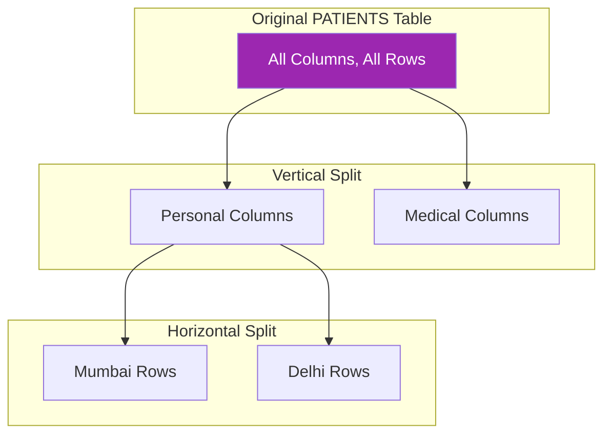
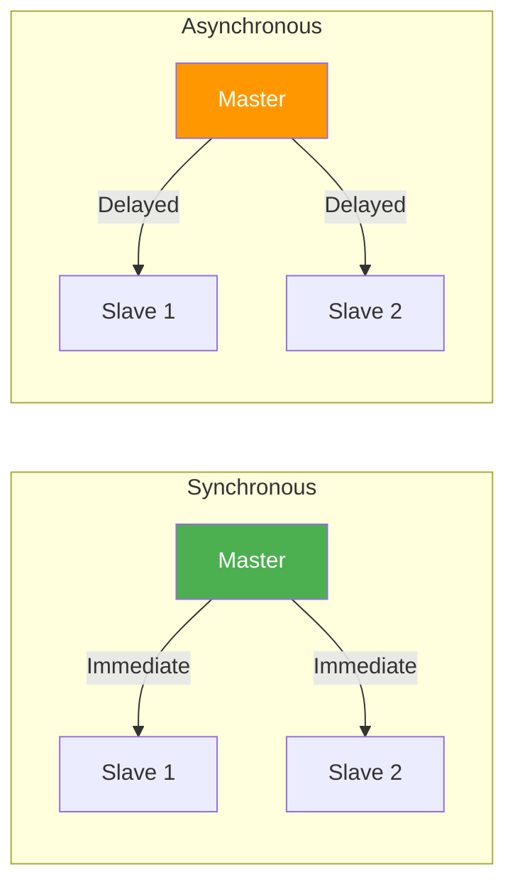
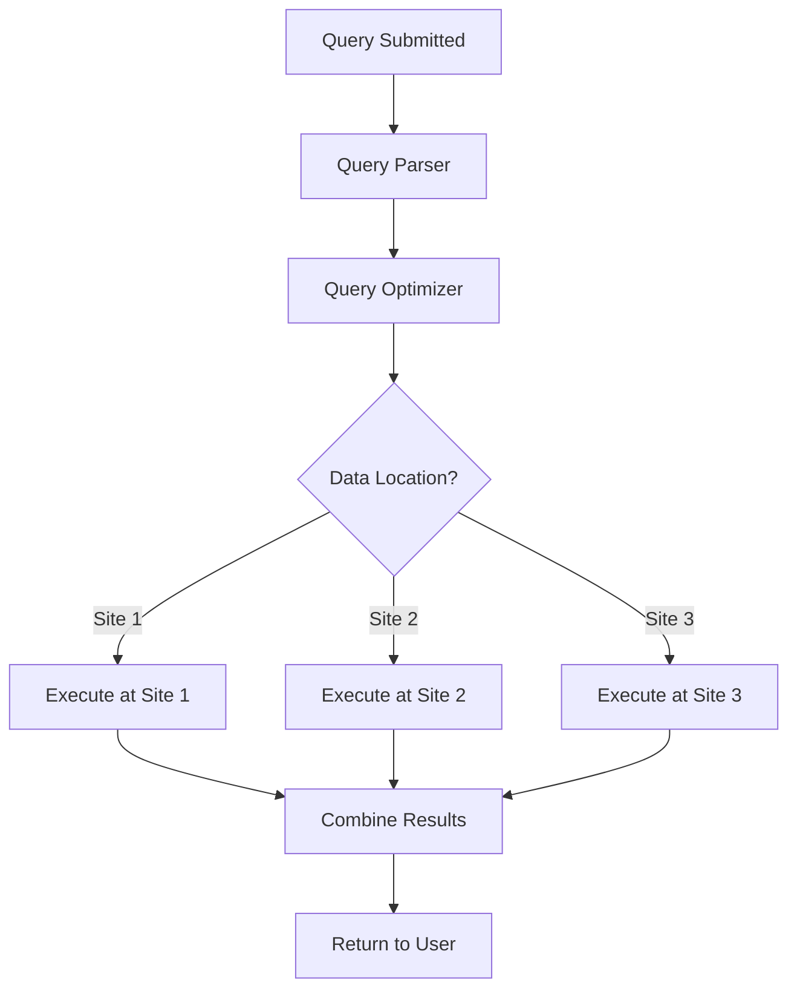
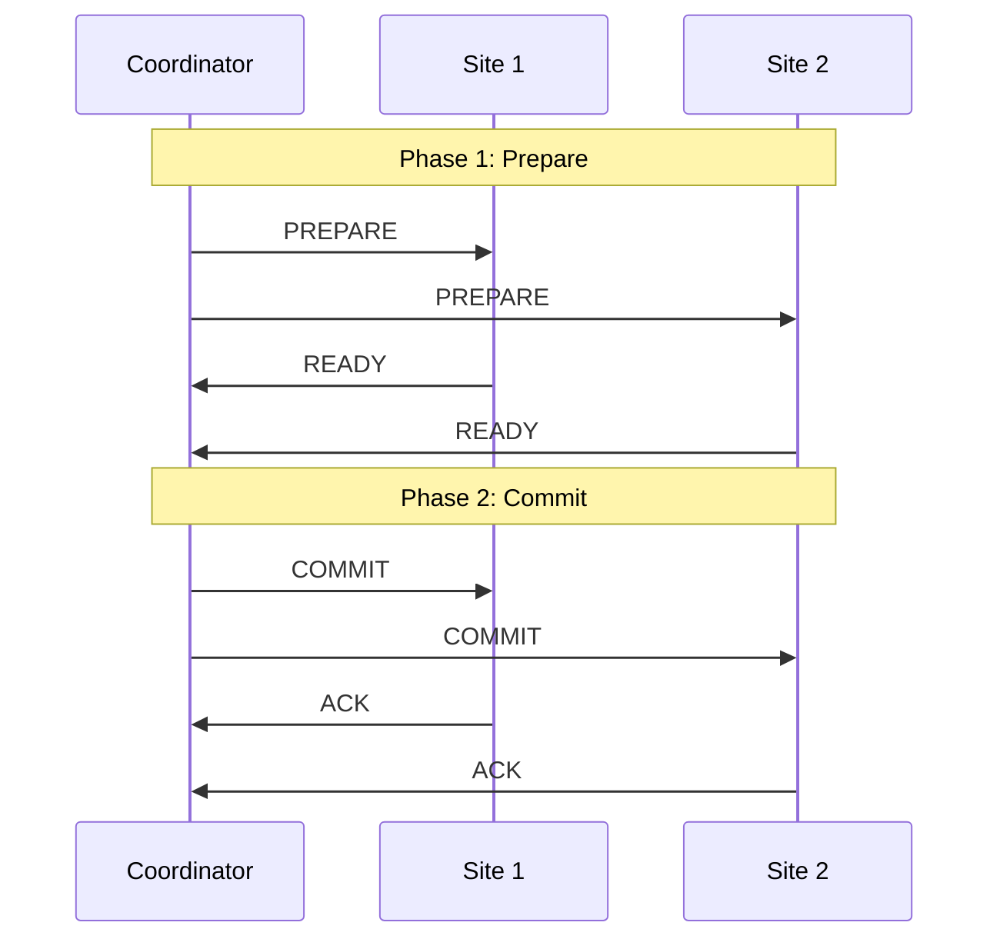
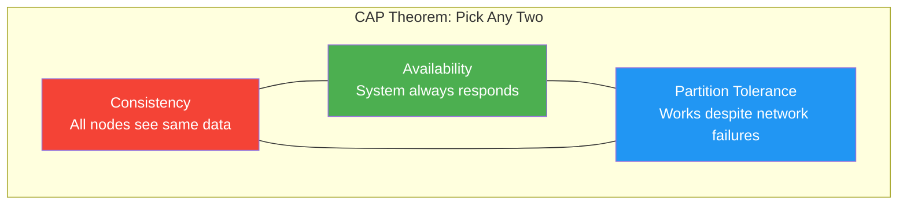

# 🌐 Distributed Database Concepts

## 🎯 What is a Distributed Database?

A **Distributed Database** is a collection of logically related databases spread across multiple physical locations, connected by a network.

---

## 📊 Distributed vs Centralized



---

## 📋 Types of Distributed Databases

### 1. Homogeneous

All sites use the **same DBMS** (e.g., all Oracle)



### 2. Heterogeneous

Different sites use **different DBMS** (e.g., Oracle, MySQL, PostgreSQL)



---

## 🏥 Healthcare System - Distributed Scenario

### Scenario: Multi-Hospital System



---

## 📊 Data Fragmentation

### 1. Horizontal Fragmentation (Row-based)

Split table by **rows** based on a condition.

```sql
-- Mumbai fragment (patients from Mumbai)
CREATE TABLE PATIENTS_MUMBAI AS
SELECT * FROM PATIENTS WHERE city = 'Mumbai';

-- Delhi fragment (patients from Delhi)
CREATE TABLE PATIENTS_DELHI AS
SELECT * FROM PATIENTS WHERE city = 'Delhi';
```

### 2. Vertical Fragmentation (Column-based)

Split table by **columns**.

```sql
-- Personal info fragment
CREATE TABLE PATIENTS_PERSONAL AS
SELECT patient_id, first_name, last_name, phone, address, city
FROM PATIENTS;

-- Medical info fragment
CREATE TABLE PATIENTS_MEDICAL AS
SELECT patient_id, blood_group, emergency_contact
FROM PATIENTS;
```

### 3. Mixed Fragmentation

Combination of horizontal and vertical.



---

## 🔄 Data Replication

### Types of Replication

| Type | Description | Use Case |
|------|-------------|----------|
| **Full Replication** | Complete copy at all sites | High availability |
| **Partial Replication** | Some data at some sites | Balanced approach |
| **No Replication** | Each data item at one site only | Storage efficiency |

### Replication Strategies



---

## 📊 Distributed Query Processing

### Query Example

```sql
-- Query spanning multiple sites
SELECT p.first_name, a.appointment_date, d.first_name AS doctor_name
FROM PATIENTS@MUMBAI_DB p
JOIN APPOINTMENTS@CENTRAL_DB a ON p.patient_id = a.patient_id
JOIN DOCTORS@DELHI_DB d ON a.doctor_id = d.doctor_id
WHERE a.appointment_date >= SYSDATE;
```

### Query Processing Steps



---

## 🔐 Distributed Transaction Management

### Two-Phase Commit (2PC)



### Phase 1: Prepare
- Coordinator asks all sites if they can commit
- Sites respond with READY or ABORT

### Phase 2: Commit/Abort
- If all sites READY → Send COMMIT
- If any site ABORT → Send ROLLBACK

---

## 📋 CAP Theorem



| Combination | Example Systems |
|-------------|-----------------|
| **CA** | Traditional RDBMS (single node) |
| **CP** | HBase, MongoDB (configurable) |
| **AP** | Cassandra, CouchDB |

---

## 📊 Advantages & Disadvantages

### ✅ Advantages

| Advantage | Description |
|-----------|-------------|
| **Local Autonomy** | Each site manages its own data |
| **Improved Performance** | Parallel processing, local queries |
| **Reliability** | No single point of failure |
| **Scalability** | Easy to add new sites |

### ❌ Disadvantages

| Disadvantage | Description |
|--------------|-------------|
| **Complexity** | Harder to design and maintain |
| **Network Dependency** | Network failure affects access |
| **Security** | More attack surface |
| **Cost** | Higher infrastructure cost |

---

## 🔗 Oracle Distributed Features

### Database Links

```sql
-- Create link to remote database
CREATE DATABASE LINK mumbai_link
CONNECT TO healthcare_user IDENTIFIED BY password
USING 'mumbai_db_tns';

-- Use database link
SELECT * FROM PATIENTS@mumbai_link;
```

### Synonyms for Transparency

```sql
-- Create synonym to hide location
CREATE SYNONYM all_patients FOR PATIENTS@mumbai_link;

-- Users query without knowing location
SELECT * FROM all_patients WHERE city = 'Mumbai';
```

---

## 🎓 Viva Quick Points

| Concept | Explanation |
|---------|-------------|
| **Distributed DB** | Data spread across multiple locations |
| **Fragmentation** | Breaking table into smaller parts |
| **Replication** | Storing copies at multiple sites |
| **2PC** | Protocol for distributed transactions |
| **CAP Theorem** | Can't have all: Consistency, Availability, Partition Tolerance |
| **Database Link** | Oracle feature to access remote DB |

---

> **📝 DBMS Concept:** Distributed databases provide scalability and reliability but introduce complexity in transaction management, concurrency control, and query optimization.
