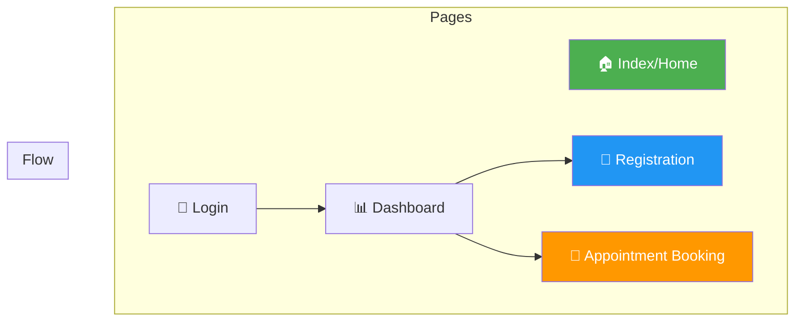
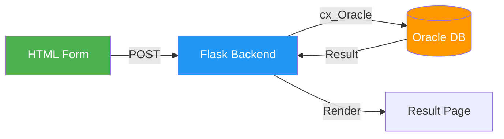

# 🎨 UI Design

## 🎯 Overview

Simple, clean HTML + CSS forms for:
- Patient Registration
- Appointment Booking
- Dashboard views

**Focus:** Demonstrate database integration, not complex frontend.

---

## 📊 UI Architecture



---

## 🎨 Design System

### Color Palette

| Color | Hex | Usage |
|-------|-----|-------|
| Primary | `#2563eb` | Buttons, links |
| Secondary | `#10b981` | Success states |
| Accent | `#8b5cf6` | Highlights |
| Background | `#f8fafc` | Page background |
| Surface | `#ffffff` | Cards, forms |
| Text | `#1e293b` | Body text |
| Text Light | `#64748b` | Secondary text |
| Error | `#ef4444` | Error messages |
| Warning | `#f59e0b` | Warning states |

### Typography

| Element | Font | Size | Weight |
|---------|------|------|--------|
| Heading 1 | Inter | 32px | 700 |
| Heading 2 | Inter | 24px | 600 |
| Body | Inter | 16px | 400 |
| Small | Inter | 14px | 400 |
| Button | Inter | 14px | 500 |

---

## 📋 Page Wireframes

### 1. Index/Home Page

```
┌─────────────────────────────────────────────────────────┐
│  🏥 Smart Healthcare System                    [Login]  │
├─────────────────────────────────────────────────────────┤
│                                                         │
│         Welcome to Smart Healthcare System              │
│         Your health is our priority                     │
│                                                         │
│    ┌──────────────┐  ┌──────────────┐  ┌─────────────┐ │
│    │ 👨‍⚕️           │  │ 📅           │  │ 📋          │ │
│    │ Our Doctors  │  │ Book        │  │ Services    │ │
│    │              │  │ Appointment │  │             │ │
│    └──────────────┘  └──────────────┘  └─────────────┘ │
│                                                         │
└─────────────────────────────────────────────────────────┘
```

---

### 2. Patient Registration Form

```
┌─────────────────────────────────────────────────────────┐
│  🏥 Smart Healthcare System           [Home] [Login]    │
├─────────────────────────────────────────────────────────┤
│                                                         │
│         📝 Patient Registration                         │
│         ──────────────────────                          │
│                                                         │
│    Personal Information                                 │
│    ┌─────────────────────────────────────────────────┐ │
│    │ First Name *         │ Last Name *              │ │
│    │ [________________]   │ [________________]       │ │
│    │                      │                          │ │
│    │ Email *              │ Phone *                  │ │
│    │ [________________]   │ [________________]       │ │
│    │                      │                          │ │
│    │ Date of Birth *      │ Gender *                 │ │
│    │ [________________]   │ [▼ Select______]         │ │
│    └─────────────────────────────────────────────────┘ │
│                                                         │
│    Medical Information                                  │
│    ┌─────────────────────────────────────────────────┐ │
│    │ Blood Group          │ Emergency Contact        │ │
│    │ [▼ Select______]     │ [________________]       │ │
│    └─────────────────────────────────────────────────┘ │
│                                                         │
│    Address                                              │
│    ┌─────────────────────────────────────────────────┐ │
│    │ Street Address                                  │ │
│    │ [___________________________________________]   │ │
│    │                                                 │ │
│    │ City                                            │ │
│    │ [___________________________________________]   │ │
│    └─────────────────────────────────────────────────┘ │
│                                                         │
│    Account                                              │
│    ┌─────────────────────────────────────────────────┐ │
│    │ Username *           │ Password *               │ │
│    │ [________________]   │ [________________]       │ │
│    └─────────────────────────────────────────────────┘ │
│                                                         │
│              [ Register Patient ]                       │
│                                                         │
└─────────────────────────────────────────────────────────┘
```

---

### 3. Appointment Booking Form

```
┌─────────────────────────────────────────────────────────┐
│  🏥 Smart Healthcare System         [Home] [Dashboard]  │
├─────────────────────────────────────────────────────────┤
│                                                         │
│         📅 Book Appointment                             │
│         ───────────────────                             │
│                                                         │
│    Select Department                                    │
│    ┌─────────────────────────────────────────────────┐ │
│    │ [▼ Select Department____________________]       │ │
│    └─────────────────────────────────────────────────┘ │
│                                                         │
│    Select Doctor                                        │
│    ┌─────────────────────────────────────────────────┐ │
│    │ [▼ Select Doctor________________________]       │ │
│    │                                                 │ │
│    │ 👨‍⚕️ Dr. Amit Sharma                              │ │
│    │ Specialization: Cardiologist                    │ │
│    │ Experience: 15 years                            │ │
│    │ Consultation Fee: ₹800                          │ │
│    └─────────────────────────────────────────────────┘ │
│                                                         │
│    Select Date & Time                                   │
│    ┌─────────────────────────────────────────────────┐ │
│    │ Date *               │ Time Slot *              │ │
│    │ [📅 Pick Date____]   │ [▼ Select Time___]       │ │
│    └─────────────────────────────────────────────────┘ │
│                                                         │
│    Reason for Visit                                     │
│    ┌─────────────────────────────────────────────────┐ │
│    │ [                                               │ │
│    │                                                 │ │
│    │                                                 │ │
│    │ _______________________________________________]│ │
│    └─────────────────────────────────────────────────┘ │
│                                                         │
│              [ Book Appointment ]                       │
│                                                         │
└─────────────────────────────────────────────────────────┘
```

---

## 📁 File Structure

```
templates/
├── base.html          # Base template with header/footer
├── index.html         # Home page
├── login.html         # Login form
├── register.html      # Patient registration
├── book_appointment.html   # Appointment booking
└── dashboard.html     # User dashboard

static/
├── css/
│   └── style.css      # Main stylesheet
├── js/
│   └── main.js        # Form validation
└── images/
    └── logo.png       # Logo (if any)
```

---

## 🎨 CSS Approach

### Modern Premium Design Features

| Feature | Implementation |
|---------|----------------|
| **Responsive** | CSS Grid + Flexbox |
| **Glassmorphism** | Backdrop blur on cards |
| **Gradients** | Subtle background gradients |
| **Shadows** | Layered box shadows |
| **Animations** | Smooth hover transitions |
| **Dark Mode** | CSS custom properties |

---

## 📊 Form Validation

### Client-Side (JavaScript)

```javascript
// Basic validation before submit
function validateForm() {
    const phone = document.getElementById('phone').value;
    const email = document.getElementById('email').value;
    
    // Phone validation
    if (!/^[0-9]{10}$/.test(phone)) {
        alert('Please enter a valid 10-digit phone number');
        return false;
    }
    
    // Email validation
    if (!/^[^\s@]+@[^\s@]+\.[^\s@]+$/.test(email)) {
        alert('Please enter a valid email address');
        return false;
    }
    
    return true;
}
```

### Server-Side (Python/Flask)

Validation in backend before database insertion.

---

## 📱 Responsive Breakpoints

| Device | Width | Layout |
|--------|-------|--------|
| Mobile | < 640px | Single column |
| Tablet | 640-1024px | Two columns |
| Desktop | > 1024px | Full layout |

---

## 🔗 DBMS Connection Point



---

> **📝 DBMS Concept:** The UI layer is the presentation tier in a 3-tier architecture. It collects user input and displays data, while all data processing happens in the database layer.
