# ⚙️ Backend Design

## 🎯 Overview

Minimal Python Flask backend demonstrating:
- HTML form → Database integration
- Oracle connectivity via cx_Oracle
- Basic CRUD operations
- Session management

---

## 📊 Architecture

```mermaid
graph TB
    subgraph "Client Layer"
        B[🌐 Browser]
    end
    
    subgraph "Application Layer"
        F[🐍 Flask Server<br/>app.py]
        R[📄 Jinja2 Templates]
    end
    
    subgraph "Database Layer"
        O[(🗄️ Oracle RDBMS)]
        P[📦 PL/SQL Objects]
    end
    
    B -->|HTTP Request| F
    F -->|Render| R
    R -->|HTML Response| B
    F -->|cx_Oracle| O
    O --> P
    
    style F fill:#4CAF50,color:#fff
    style O fill:#FF9800,color:#fff
```



---

## 📋 3-Tier Architecture

| Tier | Component | Role |
|------|-----------|------|
| **Presentation** | HTML/CSS/Jinja2 | User interface |
| **Application** | Flask (Python) | Business logic, routing |
| **Data** | Oracle RDBMS | Data storage, SQL/PL/SQL |

---

## 🔧 Technology Stack

| Component | Technology | Version |
|-----------|------------|---------|
| Language | Python | 3.8+ |
| Web Framework | Flask | 2.0+ |
| Template Engine | Jinja2 | (Bundled with Flask) |
| DB Driver | cx_Oracle | 8.0+ |
| Database | Oracle | 11g+ / 19c |

---

## 📁 Backend File Structure

```
smart-healthcare-system/
├── app.py                 # Main Flask application
├── config.py              # Database configuration
├── requirements.txt       # Python dependencies
├── templates/             # HTML templates
│   ├── base.html
│   ├── index.html
│   ├── register.html
│   └── book_appointment.html
└── static/
    └── css/
        └── style.css
```

---

## 🔌 Database Connection

### config.py

```python
# Database Configuration
ORACLE_CONFIG = {
    'user': 'healthcare_user',
    'password': 'your_password',
    'dsn': 'localhost:1521/XEPDB1'  # or your TNS name
}

# Alternative: Using TNS
# 'dsn': 'ORCL'  # as defined in tnsnames.ora
```

### Connection Pool (Recommended)

```python
import cx_Oracle

# Initialize connection pool
pool = cx_Oracle.SessionPool(
    user=ORACLE_CONFIG['user'],
    password=ORACLE_CONFIG['password'],
    dsn=ORACLE_CONFIG['dsn'],
    min=2,
    max=10,
    increment=1
)

def get_connection():
    """Get connection from pool"""
    return pool.acquire()

def release_connection(conn):
    """Release connection back to pool"""
    pool.release(conn)
```

---

## 📊 Flask Application Flow


---

## 🔧 Core Routes

### 1. Home Page

```python
@app.route('/')
def index():
    """Home page"""
    return render_template('index.html')
```

### 2. Patient Registration

```python
@app.route('/register', methods=['GET', 'POST'])
def register():
    if request.method == 'GET':
        return render_template('register.html')
    
    # POST: Process registration
    try:
        conn = get_connection()
        cursor = conn.cursor()
        
        # Call stored procedure
        result = cursor.var(cx_Oracle.STRING)
        cursor.callproc('sp_register_patient', [
            request.form['username'],
            request.form['password'],
            request.form['email'],
            request.form['first_name'],
            request.form['last_name'],
            request.form['dob'],
            request.form['gender'],
            request.form['phone'],
            request.form['address'],
            request.form['city'],
            request.form['blood_group'],
            result
        ])
        
        message = result.getvalue()
        
        if 'SUCCESS' in message:
            flash(message, 'success')
            return redirect(url_for('login'))
        else:
            flash(message, 'error')
            return render_template('register.html')
            
    except Exception as e:
        flash(f'Error: {str(e)}', 'error')
        return render_template('register.html')
    finally:
        cursor.close()
        release_connection(conn)
```

### 3. Appointment Booking

```python
@app.route('/book-appointment', methods=['GET', 'POST'])
def book_appointment():
    conn = get_connection()
    cursor = conn.cursor()
    
    if request.method == 'GET':
        # Get departments and doctors for dropdowns
        cursor.execute("SELECT dept_id, dept_name FROM DEPARTMENTS")
        departments = cursor.fetchall()
        
        cursor.execute("""
            SELECT doctor_id, first_name || ' ' || last_name, 
                   specialization, consultation_fee 
            FROM DOCTORS WHERE available = 'Y'
        """)
        doctors = cursor.fetchall()
        
        return render_template('book_appointment.html', 
                             departments=departments, 
                             doctors=doctors)
    
    # POST: Book appointment
    try:
        result = cursor.var(cx_Oracle.STRING)
        cursor.callproc('sp_book_appointment', [
            session['patient_id'],  # From logged-in user
            request.form['doctor_id'],
            request.form['appointment_date'],
            request.form['appointment_time'],
            request.form['reason'],
            result
        ])
        
        message = result.getvalue()
        flash(message, 'success' if 'SUCCESS' in message else 'error')
        
    except Exception as e:
        flash(f'Error: {str(e)}', 'error')
    finally:
        cursor.close()
        release_connection(conn)
    
    return redirect(url_for('dashboard'))
```

---

## 📊 CRUD Operations Pattern

### Create (INSERT)

```python
def create_patient(data):
    conn = get_connection()
    cursor = conn.cursor()
    try:
        cursor.execute("""
            INSERT INTO PATIENTS (patient_id, first_name, last_name, phone)
            VALUES (patient_seq.NEXTVAL, :1, :2, :3)
        """, (data['first_name'], data['last_name'], data['phone']))
        conn.commit()
        return True
    except Exception as e:
        conn.rollback()
        return False
    finally:
        cursor.close()
        release_connection(conn)
```

### Read (SELECT)

```python
def get_patient_by_id(patient_id):
    conn = get_connection()
    cursor = conn.cursor()
    try:
        cursor.execute("""
            SELECT patient_id, first_name, last_name, phone, email
            FROM PATIENTS WHERE patient_id = :1
        """, (patient_id,))
        row = cursor.fetchone()
        if row:
            return {
                'patient_id': row[0],
                'first_name': row[1],
                'last_name': row[2],
                'phone': row[3],
                'email': row[4]
            }
        return None
    finally:
        cursor.close()
        release_connection(conn)
```

### Update

```python
def update_patient_phone(patient_id, new_phone):
    conn = get_connection()
    cursor = conn.cursor()
    try:
        cursor.execute("""
            UPDATE PATIENTS SET phone = :1 WHERE patient_id = :2
        """, (new_phone, patient_id))
        conn.commit()
        return cursor.rowcount > 0
    except:
        conn.rollback()
        return False
    finally:
        cursor.close()
        release_connection(conn)
```

### Delete

```python
def cancel_appointment(appointment_id):
    conn = get_connection()
    cursor = conn.cursor()
    try:
        cursor.execute("""
            UPDATE APPOINTMENTS SET status = 'CANCELLED' 
            WHERE appointment_id = :1
        """, (appointment_id,))
        conn.commit()
        return True
    except:
        conn.rollback()
        return False
    finally:
        cursor.close()
        release_connection(conn)
```

---

## 🔐 Session Management

```python
from flask import session

# Login
@app.route('/login', methods=['POST'])
def login():
    username = request.form['username']
    password = request.form['password']
    
    conn = get_connection()
    cursor = conn.cursor()
    cursor.execute("""
        SELECT user_id, role FROM USERS 
        WHERE username = :1 AND password_hash = :2 AND status = 'ACTIVE'
    """, (username, password))  # In production, hash the password!
    
    user = cursor.fetchone()
    if user:
        session['user_id'] = user[0]
        session['role'] = user[1]
        return redirect(url_for('dashboard'))
    else:
        flash('Invalid credentials', 'error')
        return redirect(url_for('login'))

# Logout
@app.route('/logout')
def logout():
    session.clear()
    return redirect(url_for('index'))
```

---

## 📊 Error Handling

```python
@app.errorhandler(404)
def not_found(e):
    return render_template('error.html', error='Page not found'), 404

@app.errorhandler(500)
def server_error(e):
    return render_template('error.html', error='Server error'), 500

# Database error handling
try:
    # DB operations
except cx_Oracle.DatabaseError as e:
    error, = e.args
    if error.code == 1:  # Unique constraint violation
        flash('Record already exists', 'error')
    elif error.code == 2291:  # Foreign key violation
        flash('Referenced record not found', 'error')
    else:
        flash(f'Database error: {error.message}', 'error')
```

---

## 📋 Requirements.txt

```
Flask==2.3.3
cx_Oracle==8.3.0
python-dotenv==1.0.0
```

---

## 🎓 Backend's Role in DBMS Context

| Responsibility | Description |
|----------------|-------------|
| **Connection Management** | Establish and maintain DB connections |
| **Query Execution** | Execute SQL/PL/SQL via cx_Oracle |
| **Transaction Control** | COMMIT/ROLLBACK management |
| **Data Transformation** | Convert between Python objects and DB types |
| **Error Handling** | Handle DB errors gracefully |
| **Security** | Prevent SQL injection (use bind variables) |

---

## ⚠️ Security Best Practices

| Practice | Implementation |
|----------|----------------|
| **Parameterized Queries** | Use `:1, :2` instead of string formatting |
| **Password Hashing** | Hash passwords before storing |
| **Input Validation** | Validate on server-side |
| **Session Security** | Use secure session configuration |
| **Connection Security** | Use encrypted connections (SSL/TLS) |

---

> **📝 DBMS Concept:** The backend acts as a bridge between the presentation layer and the database. It enforces business rules, manages transactions, and ensures data integrity.
