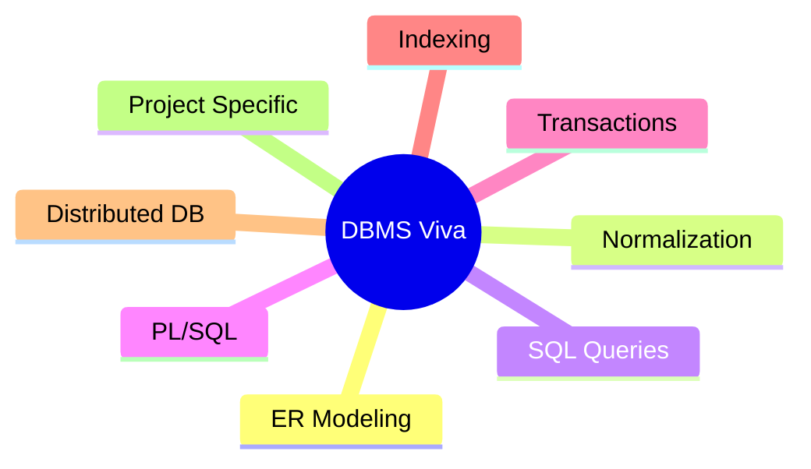

# 🎓 Viva Questions and Answers

## 📊 Question Categories



---

## 📐 ER Modeling Questions

### Q1: What is an Entity-Relationship Diagram?

**Answer:** An ER Diagram is a visual representation of database structure showing:
- **Entities** - Real-world objects (e.g., PATIENTS, DOCTORS)
- **Attributes** - Properties of entities (e.g., patient_name, phone)
- **Relationships** - Associations between entities (e.g., PATIENTS books APPOINTMENTS)
- **Cardinality** - 1:1, 1:N, M:N relationships

---

### Q2: What is the difference between weak and strong entities?

**Answer:**
| Strong Entity | Weak Entity |
|--------------|-------------|
| Has its own primary key | No unique identifier of its own |
| Exists independently | Depends on owner entity |
| Rectangle in ER | Double rectangle in ER |
| Example: PATIENTS | Example: PRESCRIPTIONS (depends on MEDICAL_RECORDS) |

---

### Q3: Explain cardinality with examples from your project.

**Answer:**
- **1:1** - One APPOINTMENT generates one BILL
- **1:N** - One DOCTOR attends many APPOINTMENTS
- **M:N** - Many PATIENTS can see many DOCTORS (resolved via APPOINTMENTS junction table)

---

## 🔄 Normalization Questions

### Q4: What is normalization? Why is it important?

**Answer:** Normalization is organizing data to:
1. **Eliminate redundancy** - No duplicate data
2. **Prevent anomalies** - Insert, update, delete anomalies
3. **Ensure data integrity** - Consistent data

**Importance:** Reduces storage, maintains consistency, simplifies updates.

---

### Q5: Explain 1NF, 2NF, 3NF with examples.

**Answer:**

**1NF (First Normal Form):**
- Atomic values only
- No repeating groups
- Example: Splitting comma-separated medicines into separate rows

**2NF (Second Normal Form):**
- Must be in 1NF
- No partial dependencies
- Example: Separating PATIENTS data from APPOINTMENTS

**3NF (Third Normal Form):**
- Must be in 2NF
- No transitive dependencies
- Example: Moving dept_name from DOCTORS to separate DEPARTMENTS table

---

### Q6: What is BCNF? How is it different from 3NF?

**Answer:**
- **BCNF** = Boyce-Codd Normal Form
- Stricter than 3NF
- **Rule:** For every FD X → Y, X must be a superkey
- **Difference:** 3NF allows non-key → key dependencies; BCNF does not

---

## 🗄️ SQL Questions

### Q7: What are DDL, DML, and DCL?

**Answer:**
| Category | Commands | Purpose |
|----------|----------|---------|
| **DDL** | CREATE, ALTER, DROP, TRUNCATE | Define structure |
| **DML** | INSERT, UPDATE, DELETE, SELECT | Manipulate data |
| **DCL** | GRANT, REVOKE | Control access |
| **TCL** | COMMIT, ROLLBACK, SAVEPOINT | Transaction control |

---

### Q8: Explain different types of JOINs.

**Answer:**
```sql
-- INNER JOIN: Returns matching rows only
SELECT * FROM PATIENTS p 
INNER JOIN APPOINTMENTS a ON p.patient_id = a.patient_id;

-- LEFT OUTER JOIN: All left table + matching right
SELECT * FROM PATIENTS p 
LEFT JOIN APPOINTMENTS a ON p.patient_id = a.patient_id;

-- RIGHT OUTER JOIN: All right table + matching left
SELECT * FROM APPOINTMENTS a 
RIGHT JOIN PATIENTS p ON p.patient_id = a.patient_id;

-- FULL OUTER JOIN: All from both tables
SELECT * FROM PATIENTS p 
FULL OUTER JOIN APPOINTMENTS a ON p.patient_id = a.patient_id;

-- CROSS JOIN: Cartesian product
SELECT * FROM PATIENTS CROSS JOIN DOCTORS;
```

---

### Q9: What is a subquery? Give an example.

**Answer:** A query nested inside another query.

```sql
-- Find patients who have appointments with senior doctors
SELECT first_name, last_name FROM PATIENTS
WHERE patient_id IN (
    SELECT patient_id FROM APPOINTMENTS
    WHERE doctor_id IN (
        SELECT doctor_id FROM DOCTORS WHERE experience_years > 10
    )
);
```

**Types:** Scalar, Single-row, Multi-row, Correlated

---

### Q10: Explain GROUP BY and HAVING.

**Answer:**
- **GROUP BY** - Groups rows sharing a common value
- **HAVING** - Filters groups (like WHERE for GROUP BY)

```sql
-- Doctors with more than 5 completed appointments
SELECT doctor_id, COUNT(*) as appointment_count
FROM APPOINTMENTS
WHERE status = 'COMPLETED'
GROUP BY doctor_id
HAVING COUNT(*) > 5;
```

**Difference:** WHERE filters rows; HAVING filters groups

---

## ⚡ PL/SQL Questions

### Q11: What is the difference between a procedure and a function?

**Answer:**
| Procedure | Function |
|-----------|----------|
| May or may not return value | Must return exactly one value |
| Uses OUT parameters | Uses RETURN statement |
| Cannot use in SELECT | Can use in SELECT |
| `CALL procedure_name()` | `SELECT function_name() FROM dual` |

---

### Q12: What is a trigger? Types of triggers?

**Answer:** A trigger is automatic code that executes on DML events.

**Types:**
| Type | When |
|------|------|
| BEFORE INSERT | Before inserting row |
| AFTER INSERT | After inserting row |
| BEFORE UPDATE | Before updating row |
| AFTER UPDATE | After updating row |
| BEFORE DELETE | Before deleting row |
| AFTER DELETE | After deleting row |

**Row-level vs Statement-level:**
- Row-level: FOR EACH ROW (executes for each affected row)
- Statement-level: Once per statement

---

### Q13: What is exception handling in PL/SQL?

**Answer:**
```sql
BEGIN
    -- Code that might fail
    SELECT * INTO v_patient FROM PATIENTS WHERE patient_id = 999;
EXCEPTION
    WHEN NO_DATA_FOUND THEN
        DBMS_OUTPUT.PUT_LINE('Patient not found');
    WHEN TOO_MANY_ROWS THEN
        DBMS_OUTPUT.PUT_LINE('Multiple patients found');
    WHEN OTHERS THEN
        DBMS_OUTPUT.PUT_LINE('Error: ' || SQLERRM);
END;
```

---

## 🔄 Transaction Questions

### Q14: What are ACID properties?

**Answer:**
| Property | Meaning | Example |
|----------|---------|---------|
| **Atomicity** | All or nothing | Transfer money: debit + credit both happen or neither |
| **Consistency** | Valid state to valid state | Total money remains constant |
| **Isolation** | Concurrent transactions separated | Other users don't see partial transfer |
| **Durability** | Committed = Permanent | Survives power failure |

---

### Q15: What is a deadlock? How to prevent it?

**Answer:** Deadlock occurs when two transactions wait for each other indefinitely.

**Prevention:**
1. Lock ordering - Access resources in same order
2. Lock timeout - Release after timeout
3. Deadlock detection - DBMS detects and kills one transaction

---

### Q16: Explain isolation levels.

**Answer:**
| Level | Dirty Read | Non-Repeatable | Phantom |
|-------|------------|----------------|---------|
| READ UNCOMMITTED | ✅ | ✅ | ✅ |
| READ COMMITTED | ❌ | ✅ | ✅ |
| REPEATABLE READ | ❌ | ❌ | ✅ |
| SERIALIZABLE | ❌ | ❌ | ❌ |

**Oracle default:** READ COMMITTED

---

## 🔍 Indexing Questions

### Q17: What is an index? Why use it?

**Answer:** Index is a data structure for faster data retrieval.

**Advantages:**
- Faster SELECT queries
- Efficient WHERE clause filtering
- Faster ORDER BY

**Disadvantages:**
- Slower INSERT/UPDATE/DELETE (index maintenance)
- Extra storage space

---

### Q18: Types of indexes in Oracle?

**Answer:**
| Type | Best For |
|------|----------|
| **B-Tree** | High cardinality, equality/range queries |
| **Bitmap** | Low cardinality, data warehouse |
| **Function-Based** | Queries with functions (UPPER, LOWER) |
| **Composite** | Multi-column WHERE clauses |
| **Unique** | Primary keys, unique constraints |

---

### Q19: When should you NOT use an index?

**Answer:**
1. Small tables (full scan faster)
2. Frequently updated columns
3. Low cardinality columns (in OLTP)
4. Columns rarely used in WHERE
5. Tables with heavy INSERT/UPDATE activity

---

## 🌐 Distributed Database Questions

### Q20: What is a distributed database?

**Answer:** A database where data is stored across multiple physical locations connected by a network.

**Characteristics:**
- Location transparency
- Data independence
- Distributed query processing
- Distributed transaction management

---

### Q21: What is the CAP theorem?

**Answer:** In a distributed system, you can only guarantee 2 of 3:
- **C**onsistency - All nodes see same data
- **A**vailability - System always responds
- **P**artition tolerance - Works despite network failures

---

### Q22: What is data fragmentation?

**Answer:**
| Type | Description | Example |
|------|-------------|---------|
| **Horizontal** | Split by rows | Mumbai patients vs Delhi patients |
| **Vertical** | Split by columns | Personal info vs Medical info |
| **Mixed** | Combination | Both row and column splits |

---

## 🏥 Project-Specific Questions

### Q23: Explain the ER diagram of your project.

**Answer:** Our Smart Healthcare System has:
- **6 main entities:** USERS, PATIENTS, DOCTORS, DEPARTMENTS, APPOINTMENTS, BILLS
- **Key relationships:**
  - USERS → PATIENTS/DOCTORS (specialization/ISA)
  - PATIENTS 1:N APPOINTMENTS
  - DOCTORS 1:N APPOINTMENTS
  - APPOINTMENTS 1:1 BILLS
  - BILLS 1:N PAYMENTS

---

### Q24: How did you implement user roles?

**Answer:** Using **specialization/ISA** relationship:
- Base table: USERS (common attributes)
- Child tables: PATIENTS, DOCTORS, ADMINS (specific attributes)
- Role column in USERS acts as discriminator
- Each user type has different permissions

---

### Q25: What PL/SQL objects did you create?

**Answer:**
1. **Procedure sp_register_patient** - Creates user + patient in one transaction
2. **Procedure sp_book_appointment** - Books with validation
3. **Function fn_calculate_age** - Returns patient age
4. **Trigger trg_auto_generate_bill** - Creates bill when appointment completed
5. **Trigger trg_patient_audit** - Logs patient record changes

---

### Q26: How did you handle data integrity?

**Answer:**
1. **Primary Keys** - Unique identification
2. **Foreign Keys** - Referential integrity
3. **CHECK constraints** - Valid values (gender, status)
4. **NOT NULL** - Required fields
5. **UNIQUE** - No duplicates (email, username)
6. **Triggers** - Business rules enforcement

---

## 📋 Quick Reference Table

| Topic | Key Points |
|-------|------------|
| **ER Diagram** | Entities, Attributes, Relationships, Cardinality |
| **Normalization** | 1NF (atomic), 2NF (no partial), 3NF (no transitive) |
| **SQL** | DDL, DML, JOIN types, Subqueries |
| **PL/SQL** | Procedures, Functions, Triggers, Exceptions |
| **ACID** | Atomicity, Consistency, Isolation, Durability |
| **Indexing** | B-Tree, Bitmap, When to use/avoid |
| **Distributed** | CAP theorem, Fragmentation, 2PC |

---

> **💡 Tip:** When answering viva questions, always try to relate concepts to your project. Use examples from the Healthcare System to demonstrate understanding.
