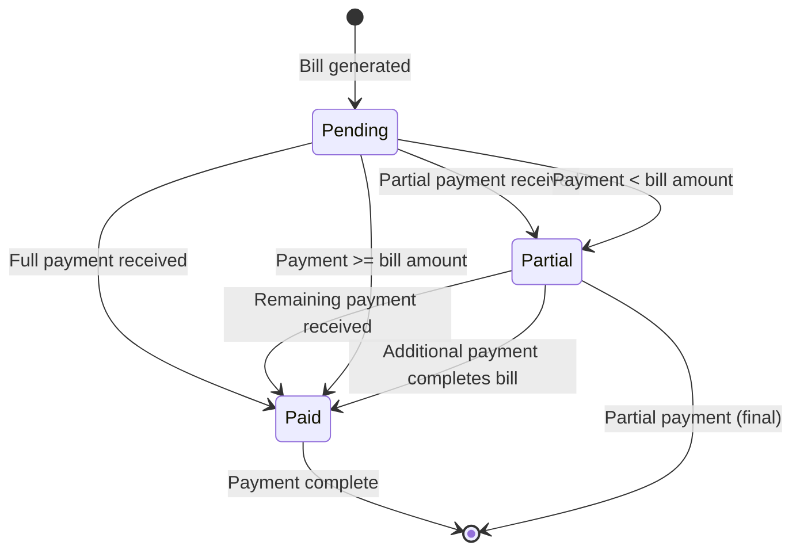
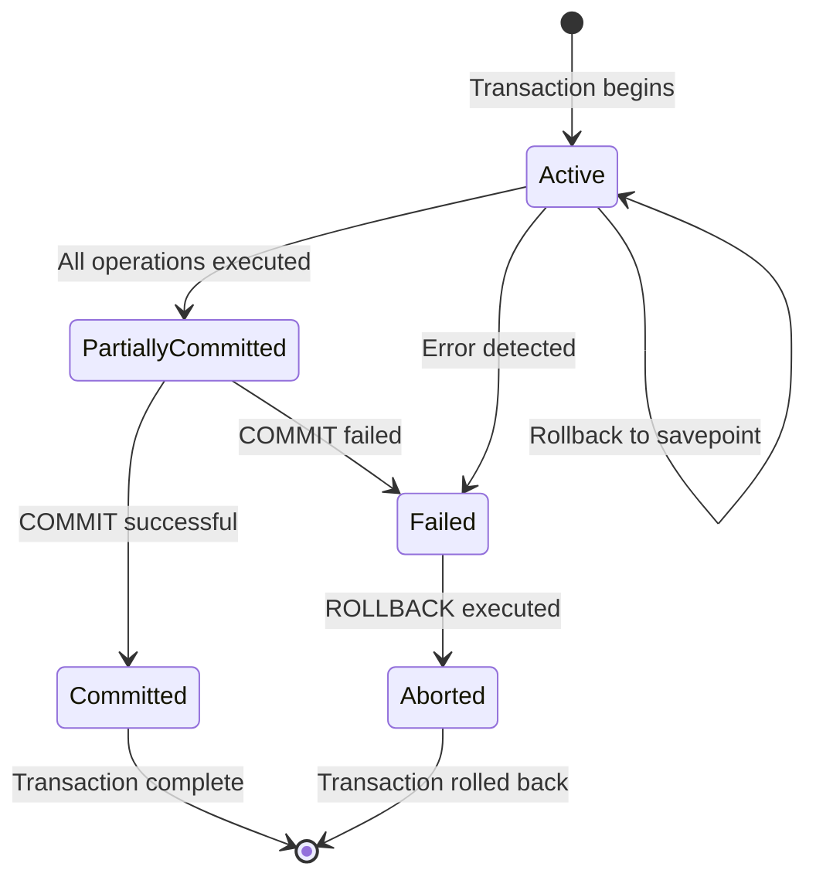
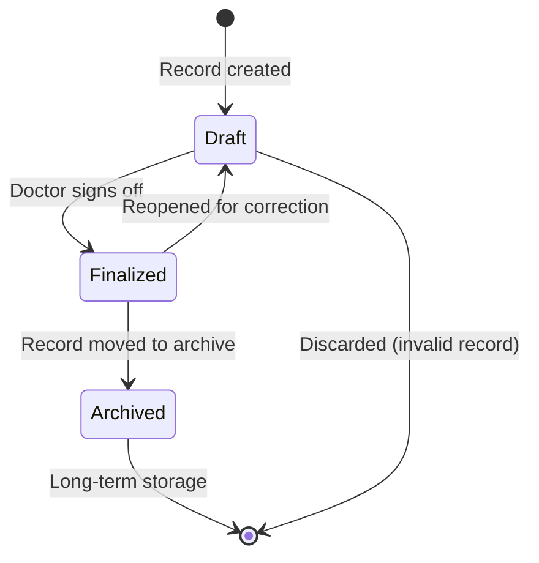
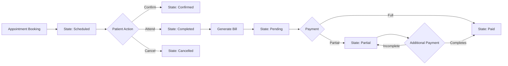

# 🔄 State Transition Diagram

## 🎯 Appointment Lifecycle State Transitions

This diagram illustrates the state transitions for appointments in the Smart Healthcare Management System.

```mermaid
stateDiagram-v2
    [*] --> Scheduled: Appointment booked
    Scheduled --> Completed: Appointment attended
    Scheduled --> Cancelled: Appointment cancelled
    Completed --> [*]: Final state
    Cancelled --> [*]: Final state

    state Scheduled {
        [*] --> PendingConfirmation
        PendingConfirmation --> Confirmed: Patient confirms
        PendingConfirmation --> Scheduled: Auto-confirmed after 24h
        Confirmed --> [*]: Final confirmed state
    }

    state Completed {
        [*] --> Billed: Bill generated
        Billed --> Paid: Payment received
        Billed --> Partial: Partial payment received
        Paid --> [*]: Fully paid
        Partial --> Paid: Remaining payment received
        Partial --> [*]: Partially paid (final)
    }

    state Cancelled {
        [*] --> RefundInitiated: Refund requested
        RefundInitiated --> Refunded: Refund processed
        RefundInitiated --> Rejected: Refund denied
        Refunded --> [*]: Refund completed
        Rejected --> [*]: Refund rejected
    }

    %% Transition labels
    Scheduled --> Completed: Mark as attended
    Scheduled --> Cancelled: Patient/cancelled
    Completed --> Scheduled: Reopen appointment (admin)
    Cancelled --> Scheduled: Reschedule request
```

## 💰 Billing and Payment State Transitions



## 🔄 Transaction State Transitions

Based on the ACID properties documentation:



## 🏥 Medical Record State Transitions



## 📋 State Transition Summary

| Entity             | States                                                                                                                      | Key Transitions                       |
| ------------------ | --------------------------------------------------------------------------------------------------------------------------- | ------------------------------------- |
| **Appointment**    | Scheduled, PendingConfirmation, Confirmed, Completed, Billed, Paid, Partial, Cancelled, RefundInitiated, Refunded, Rejected | Book → Confirm → Attend → Bill → Pay  |
| **Bill**           | Pending, Paid, Partial                                                                                                      | Generate → Receive Payment → Complete |
| **Transaction**    | Active, PartiallyCommitted, Failed, Committed, Aborted                                                                      | Begin → Execute → Commit/Rollback     |
| **Medical Record** | Draft, Finalized, Archived                                                                                                  | Create → Review → Archive             |

## 🔗 Integration Points



> **📝 DBMS Concept:** State transitions are crucial for tracking the lifecycle of entities in a database system. They help maintain data integrity by ensuring that entities can only transition through valid states based on business rules.
