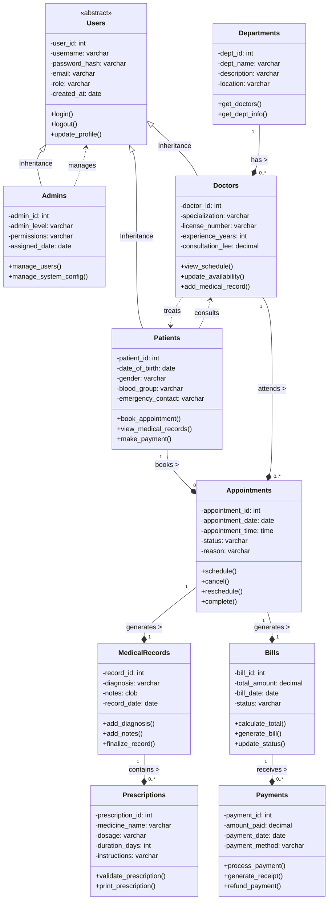
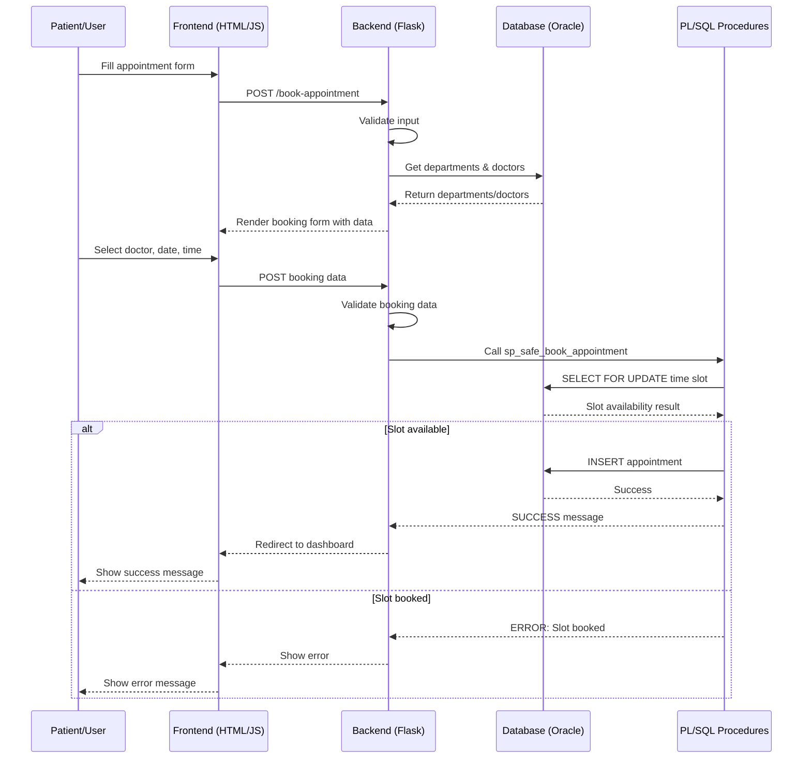
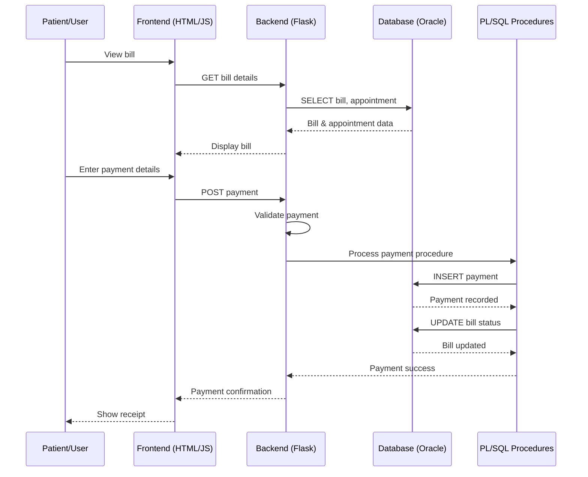
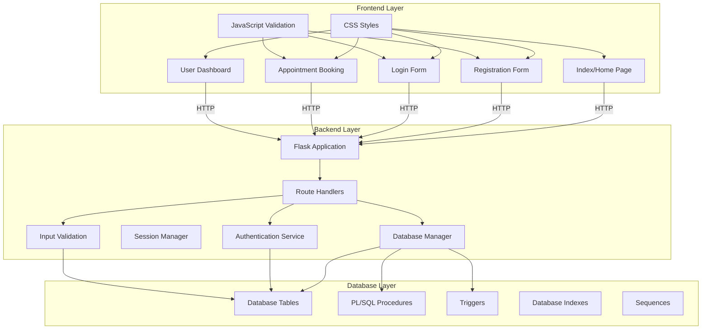

# 📐 UML Class Diagram

## 🎯 Smart Healthcare Management System - Class Diagram

This diagram represents the static structure of the system showing classes, their attributes, methods, and relationships.

## 🔄 Sequence Diagram: Appointment Booking Flow

## 📊 Sequence Diagram: Payment Processing

## 🏥 Component Diagram

## 📋 Class Description Summary

| Class              | Responsibility        | Key Attributes                 | Key Methods                                   |
| ------------------ | --------------------- | ------------------------------ | --------------------------------------------- |
| **Users**          | Base user entity      | user_id, username, email, role | login(), logout(), update_profile()           |
| **Admins**         | System administrators | admin_level, permissions       | manage_users(), manage_system_config()        |
| **Doctors**        | Medical practitioners | specialization, license_number | view_schedule(), add_medical_record()         |
| **Patients**       | Healthcare recipients | date_of_blood, blood_group     | book_appointment(), make_payment()            |
| **Departments**    | Medical departments   | dept_name, location            | get_doctors(), get_dept_info()                |
| **Appointments**   | Scheduled visits      | date, time, status, reason     | schedule(), cancel(), complete()              |
| **MedicalRecords** | Visit documentation   | diagnosis, notes               | add_diagnosis(), finalize_record()            |
| **Prescriptions**  | Medication orders     | medicine_name, dosage          | validate_prescription(), print_prescription() |
| **Bills**          | Financial charges     | total_amount, status           | calculate_total(), generate_bill()            |
| **Payments**       | Payment transactions  | amount, method                 | process_payment(), generate_receipt()         |

## 🔗 Relationships Explained

1. **Inheritance**: Admins, Doctors, and Patients inherit from Users (using single table with discriminator)
2. **Composition**: Departments compose Doctors (1:many relationship)
3. **Association**: Patients and Doctors associate through Appointments
4. **Dependency**: Appointments generate MedicalRecords and Bills
5. **Aggregation**: Bills receive multiple Payments

> **📝 DBMS Concept:** UML class diagrams provide a static view of the system, showing the classes, their attributes, operations, and the relationships among objects. This helps in understanding the system structure and serves as a blueprint for implementation.
