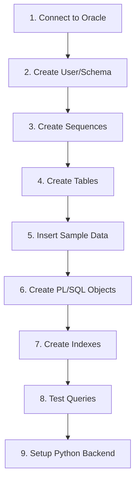

# 📋 Workhuman - Step-by-Step Oracle Database Setup

This guide helps you manually set up the Smart Healthcare database in Oracle **without MCP**.

---

## 🛠️ Prerequisites

| Requirement | Details |
|-------------|---------|
| **Oracle Database** | Oracle XE 18c/21c or Oracle 19c |
| **SQL Client** | SQL*Plus, SQL Developer, or DBeaver |
| **Python** | Python 3.8+ (for backend) |
| **Oracle Instant Client** | Required for cx_Oracle |

---

## 📊 Setup Workflow



---

## 🔌 Step 1: Connect to Oracle

### Using SQL*Plus

```bash
# Connect as SYSDBA (to create user)
sqlplus sys as sysdba

# Or connect to PDB
sqlplus sys@XEPDB1 as sysdba
```

### Using SQL Developer

1. Open SQL Developer
2. Create new connection:
   - **Name:** HEALTHCARE_ADMIN
   - **Username:** sys
   - **Password:** your_password
   - **Role:** SYSDBA
   - **Hostname:** localhost
   - **Port:** 1521
   - **SID/Service:** XEPDB1 (or ORCL)

---

## 👤 Step 2: Create User/Schema

```sql
-- Connect as SYSDBA first
-- Create user for healthcare system
CREATE USER healthcare_user IDENTIFIED BY healthcare123;

-- Grant privileges
GRANT CONNECT, RESOURCE TO healthcare_user;
GRANT CREATE SESSION TO healthcare_user;
GRANT CREATE TABLE TO healthcare_user;
GRANT CREATE SEQUENCE TO healthcare_user;
GRANT CREATE PROCEDURE TO healthcare_user;
GRANT CREATE TRIGGER TO healthcare_user;
GRANT CREATE VIEW TO healthcare_user;
GRANT UNLIMITED TABLESPACE TO healthcare_user;

-- Commit
COMMIT;
```

### Connect as healthcare_user

```bash
sqlplus healthcare_user/healthcare123@XEPDB1
```

---

## 🔢 Step 3: Create Sequences

```sql
-- Run as healthcare_user
-- Create sequences for auto-increment IDs

CREATE SEQUENCE user_seq START WITH 1 INCREMENT BY 1;
CREATE SEQUENCE dept_seq START WITH 1 INCREMENT BY 1;
CREATE SEQUENCE doctor_seq START WITH 1 INCREMENT BY 1;
CREATE SEQUENCE patient_seq START WITH 1 INCREMENT BY 1;
CREATE SEQUENCE appointment_seq START WITH 1 INCREMENT BY 1;
CREATE SEQUENCE record_seq START WITH 1 INCREMENT BY 1;
CREATE SEQUENCE prescription_seq START WITH 1 INCREMENT BY 1;
CREATE SEQUENCE bill_seq START WITH 1 INCREMENT BY 1;
CREATE SEQUENCE payment_seq START WITH 1 INCREMENT BY 1;
CREATE SEQUENCE audit_log_seq START WITH 1 INCREMENT BY 1;

-- Verify
SELECT sequence_name FROM user_sequences;
```

---

## 📦 Step 4: Create Tables

Run `sql/01_create_tables.sql` or execute these commands:

```sql
-- 1. USERS Table
CREATE TABLE USERS (
    user_id         NUMBER PRIMARY KEY,
    username        VARCHAR2(50) UNIQUE NOT NULL,
    password_hash   VARCHAR2(255) NOT NULL,
    email           VARCHAR2(100) UNIQUE,
    role            VARCHAR2(20) NOT NULL CHECK (role IN ('ADMIN', 'DOCTOR', 'PATIENT')),
    status          VARCHAR2(20) DEFAULT 'ACTIVE',
    created_at      DATE DEFAULT SYSDATE
);

-- 2. DEPARTMENTS Table
CREATE TABLE DEPARTMENTS (
    dept_id         NUMBER PRIMARY KEY,
    dept_name       VARCHAR2(50) UNIQUE NOT NULL,
    description     VARCHAR2(200),
    location        VARCHAR2(50)
);

-- 3. DOCTORS Table
CREATE TABLE DOCTORS (
    doctor_id       NUMBER PRIMARY KEY,
    user_id         NUMBER UNIQUE REFERENCES USERS(user_id),
    dept_id         NUMBER REFERENCES DEPARTMENTS(dept_id),
    first_name      VARCHAR2(50) NOT NULL,
    last_name       VARCHAR2(50) NOT NULL,
    specialization  VARCHAR2(100) NOT NULL,
    license_number  VARCHAR2(50) UNIQUE,
    phone           VARCHAR2(15) NOT NULL,
    experience_years NUMBER,
    consultation_fee NUMBER(10,2) NOT NULL,
    available       CHAR(1) DEFAULT 'Y' CHECK (available IN ('Y', 'N'))
);

-- 4. PATIENTS Table
CREATE TABLE PATIENTS (
    patient_id      NUMBER PRIMARY KEY,
    user_id         NUMBER UNIQUE REFERENCES USERS(user_id),
    first_name      VARCHAR2(50) NOT NULL,
    last_name       VARCHAR2(50) NOT NULL,
    date_of_birth   DATE NOT NULL,
    gender          VARCHAR2(10) CHECK (gender IN ('Male', 'Female', 'Other')),
    phone           VARCHAR2(15) NOT NULL,
    address         VARCHAR2(200),
    city            VARCHAR2(50),
    blood_group     VARCHAR2(5),
    emergency_contact VARCHAR2(15),
    registered_date DATE DEFAULT SYSDATE
);

-- 5. APPOINTMENTS Table
CREATE TABLE APPOINTMENTS (
    appointment_id  NUMBER PRIMARY KEY,
    patient_id      NUMBER NOT NULL REFERENCES PATIENTS(patient_id),
    doctor_id       NUMBER NOT NULL REFERENCES DOCTORS(doctor_id),
    appointment_date DATE NOT NULL,
    appointment_time VARCHAR2(10) NOT NULL,
    status          VARCHAR2(20) DEFAULT 'SCHEDULED'
                    CHECK (status IN ('SCHEDULED', 'COMPLETED', 'CANCELLED', 'NO_SHOW')),
    reason          VARCHAR2(500),
    created_at      DATE DEFAULT SYSDATE
);

-- 6. MEDICAL_RECORDS Table
CREATE TABLE MEDICAL_RECORDS (
    record_id       NUMBER PRIMARY KEY,
    appointment_id  NUMBER UNIQUE REFERENCES APPOINTMENTS(appointment_id),
    patient_id      NUMBER REFERENCES PATIENTS(patient_id),
    doctor_id       NUMBER REFERENCES DOCTORS(doctor_id),
    diagnosis       VARCHAR2(500),
    symptoms        VARCHAR2(500),
    notes           CLOB,
    record_date     DATE DEFAULT SYSDATE
);

-- 7. PRESCRIPTIONS Table
CREATE TABLE PRESCRIPTIONS (
    prescription_id NUMBER PRIMARY KEY,
    record_id       NUMBER NOT NULL REFERENCES MEDICAL_RECORDS(record_id),
    medicine_name   VARCHAR2(100) NOT NULL,
    dosage          VARCHAR2(50),
    frequency       VARCHAR2(50),
    duration_days   NUMBER,
    instructions    VARCHAR2(200)
);

-- 8. BILLS Table
CREATE TABLE BILLS (
    bill_id         NUMBER PRIMARY KEY,
    appointment_id  NUMBER UNIQUE REFERENCES APPOINTMENTS(appointment_id),
    patient_id      NUMBER REFERENCES PATIENTS(patient_id),
    consultation_fee NUMBER(10,2),
    medicine_fee    NUMBER(10,2) DEFAULT 0,
    lab_fee         NUMBER(10,2) DEFAULT 0,
    total_amount    NUMBER(10,2) NOT NULL,
    discount        NUMBER(5,2) DEFAULT 0,
    final_amount    NUMBER(10,2),
    bill_date       DATE DEFAULT SYSDATE,
    status          VARCHAR2(20) DEFAULT 'PENDING'
                    CHECK (status IN ('PENDING', 'PAID', 'PARTIAL'))
);

-- 9. PAYMENTS Table
CREATE TABLE PAYMENTS (
    payment_id      NUMBER PRIMARY KEY,
    bill_id         NUMBER NOT NULL REFERENCES BILLS(bill_id),
    amount_paid     NUMBER(10,2) NOT NULL,
    payment_date    DATE DEFAULT SYSDATE,
    payment_method  VARCHAR2(20) CHECK (payment_method IN ('CASH', 'CARD', 'UPI', 'INSURANCE')),
    transaction_ref VARCHAR2(50)
);

-- 10. PATIENT_AUDIT_LOG (for trigger)
CREATE TABLE PATIENT_AUDIT_LOG (
    log_id          NUMBER PRIMARY KEY,
    patient_id      NUMBER,
    action          VARCHAR2(10),
    changed_by      VARCHAR2(50),
    change_date     DATE DEFAULT SYSDATE,
    old_phone       VARCHAR2(15),
    new_phone       VARCHAR2(15),
    old_address     VARCHAR2(200),
    new_address     VARCHAR2(200)
);

-- Verify tables
SELECT table_name FROM user_tables ORDER BY table_name;
```

---

## 📝 Step 5: Insert Sample Data

Run `sql/02_insert_data.sql` or execute:

```sql
-- Departments
INSERT INTO DEPARTMENTS VALUES (dept_seq.NEXTVAL, 'Cardiology', 'Heart and cardiovascular care', 'Building A, Floor 2');
INSERT INTO DEPARTMENTS VALUES (dept_seq.NEXTVAL, 'Orthopedics', 'Bone and joint treatment', 'Building B, Floor 1');
INSERT INTO DEPARTMENTS VALUES (dept_seq.NEXTVAL, 'Neurology', 'Brain and nervous system', 'Building A, Floor 3');
INSERT INTO DEPARTMENTS VALUES (dept_seq.NEXTVAL, 'Pediatrics', 'Child healthcare', 'Building C, Floor 1');
INSERT INTO DEPARTMENTS VALUES (dept_seq.NEXTVAL, 'Dermatology', 'Skin care', 'Building B, Floor 2');

-- Users
INSERT INTO USERS VALUES (user_seq.NEXTVAL, 'admin1', 'admin123hash', 'admin@hospital.com', 'ADMIN', 'ACTIVE', SYSDATE);
INSERT INTO USERS VALUES (user_seq.NEXTVAL, 'dr_sharma', 'doc123hash', 'sharma@hospital.com', 'DOCTOR', 'ACTIVE', SYSDATE);
INSERT INTO USERS VALUES (user_seq.NEXTVAL, 'dr_patel', 'doc456hash', 'patel@hospital.com', 'DOCTOR', 'ACTIVE', SYSDATE);
INSERT INTO USERS VALUES (user_seq.NEXTVAL, 'dr_gupta', 'doc789hash', 'gupta@hospital.com', 'DOCTOR', 'ACTIVE', SYSDATE);
INSERT INTO USERS VALUES (user_seq.NEXTVAL, 'patient_raj', 'pat123hash', 'raj@email.com', 'PATIENT', 'ACTIVE', SYSDATE);
INSERT INTO USERS VALUES (user_seq.NEXTVAL, 'patient_priya', 'pat456hash', 'priya@email.com', 'PATIENT', 'ACTIVE', SYSDATE);
INSERT INTO USERS VALUES (user_seq.NEXTVAL, 'patient_amit', 'pat789hash', 'amit@email.com', 'PATIENT', 'ACTIVE', SYSDATE);

-- Doctors
INSERT INTO DOCTORS VALUES (doctor_seq.NEXTVAL, 2, 1, 'Amit', 'Sharma', 'Cardiologist', 'MCI-12345', '9876543210', 15, 800.00, 'Y');
INSERT INTO DOCTORS VALUES (doctor_seq.NEXTVAL, 3, 2, 'Neha', 'Patel', 'Orthopedic Surgeon', 'MCI-67890', '9876543211', 10, 600.00, 'Y');
INSERT INTO DOCTORS VALUES (doctor_seq.NEXTVAL, 4, 3, 'Rahul', 'Gupta', 'Neurologist', 'MCI-11111', '9876543212', 8, 750.00, 'Y');

-- Patients
INSERT INTO PATIENTS VALUES (patient_seq.NEXTVAL, 5, 'Raj', 'Kumar', TO_DATE('1990-05-15', 'YYYY-MM-DD'), 'Male', '9123456789', '123 Main Street', 'Mumbai', 'A+', '9123456780', SYSDATE);
INSERT INTO PATIENTS VALUES (patient_seq.NEXTVAL, 6, 'Priya', 'Singh', TO_DATE('1985-08-22', 'YYYY-MM-DD'), 'Female', '9123456788', '456 Park Avenue', 'Delhi', 'B+', '9123456781', SYSDATE);
INSERT INTO PATIENTS VALUES (patient_seq.NEXTVAL, 7, 'Amit', 'Verma', TO_DATE('1995-12-10', 'YYYY-MM-DD'), 'Male', '9123456787', '789 Lake View', 'Bangalore', 'O+', NULL, SYSDATE);

-- Appointments
INSERT INTO APPOINTMENTS VALUES (appointment_seq.NEXTVAL, 1, 1, TO_DATE('2024-02-15', 'YYYY-MM-DD'), '10:00 AM', 'SCHEDULED', 'Chest pain');
INSERT INTO APPOINTMENTS VALUES (appointment_seq.NEXTVAL, 2, 2, TO_DATE('2024-02-16', 'YYYY-MM-DD'), '11:30 AM', 'COMPLETED', 'Knee pain after fall');
INSERT INTO APPOINTMENTS VALUES (appointment_seq.NEXTVAL, 3, 3, TO_DATE('2024-02-17', 'YYYY-MM-DD'), '09:00 AM', 'SCHEDULED', 'Headaches');

-- Medical Records (for completed appointment)
INSERT INTO MEDICAL_RECORDS VALUES (record_seq.NEXTVAL, 2, 2, 2, 'Mild knee sprain', 'Pain and swelling', 'Apply ice, rest for 1 week', SYSDATE);

-- Prescriptions
INSERT INTO PRESCRIPTIONS VALUES (prescription_seq.NEXTVAL, 1, 'Ibuprofen', '400mg', 'Twice daily', 7, 'Take after food');
INSERT INTO PRESCRIPTIONS VALUES (prescription_seq.NEXTVAL, 1, 'Crepe Bandage', 'Apply', 'As needed', 14, 'Wrap around knee');

-- Bills
INSERT INTO BILLS VALUES (bill_seq.NEXTVAL, 2, 2, 600, 150, 0, 750, 0, 750, SYSDATE, 'PAID');

-- Payments
INSERT INTO PAYMENTS VALUES (payment_seq.NEXTVAL, 1, 750, SYSDATE, 'CARD', 'TXN123456');

COMMIT;

-- Verify data
SELECT 'DEPARTMENTS' as tbl, COUNT(*) as cnt FROM DEPARTMENTS UNION ALL
SELECT 'USERS', COUNT(*) FROM USERS UNION ALL
SELECT 'DOCTORS', COUNT(*) FROM DOCTORS UNION ALL
SELECT 'PATIENTS', COUNT(*) FROM PATIENTS UNION ALL
SELECT 'APPOINTMENTS', COUNT(*) FROM APPOINTMENTS;
```

---

## ⚡ Step 6: Create PL/SQL Objects

Run `sql/03_plsql_objects.sql` or execute:

```sql
-- See docs/09_PLSQL_Objects.md for full code
-- Create sp_register_patient, sp_book_appointment, fn_calculate_age, triggers
```

---

## 🔍 Step 7: Create Indexes

```sql
CREATE INDEX idx_appointment_date ON APPOINTMENTS(appointment_date);
CREATE INDEX idx_appointment_status ON APPOINTMENTS(status);
CREATE INDEX idx_patient_phone ON PATIENTS(phone);
CREATE INDEX idx_doctor_specialization ON DOCTORS(specialization);
CREATE INDEX idx_bill_status ON BILLS(status);

-- Composite indexes
CREATE INDEX idx_appointment_slot ON APPOINTMENTS(doctor_id, appointment_date, appointment_time);
CREATE INDEX idx_patient_name ON PATIENTS(last_name, first_name);

-- Verify
SELECT index_name, table_name FROM user_indexes WHERE table_name IN ('APPOINTMENTS', 'PATIENTS');
```

---

## ✅ Step 8: Test Queries

```sql
-- Test 1: Join query - Appointments with details
SELECT 
    a.appointment_id,
    p.first_name || ' ' || p.last_name AS patient,
    d.first_name || ' ' || d.last_name AS doctor,
    a.appointment_date,
    a.status
FROM APPOINTMENTS a
JOIN PATIENTS p ON a.patient_id = p.patient_id
JOIN DOCTORS d ON a.doctor_id = d.doctor_id;

-- Test 2: Aggregate query
SELECT d.dept_name, COUNT(doc.doctor_id) AS doctor_count
FROM DEPARTMENTS d
LEFT JOIN DOCTORS doc ON d.dept_id = doc.dept_id
GROUP BY d.dept_name;

-- Test 3: Test procedure (if created)
DECLARE
    v_result VARCHAR2(200);
BEGIN
    sp_book_appointment(1, 1, SYSDATE + 7, '02:00 PM', 'Follow-up checkup', v_result);
    DBMS_OUTPUT.PUT_LINE(v_result);
END;
/
```

---

## 🐍 Step 9: Setup Python Backend

### Install Dependencies

```bash
# Create virtual environment
python -m venv venv

# Activate (Windows)
venv\Scripts\activate

# Install packages
pip install Flask cx_Oracle python-dotenv
```

### Configure Oracle Instant Client

1. Download Oracle Instant Client from [Oracle website](https://www.oracle.com/database/technologies/instant-client/downloads.html)
2. Extract to folder (e.g., `C:\oracle\instantclient_19_11`)
3. Add to PATH or set in Python:

```python
import cx_Oracle
cx_Oracle.init_oracle_client(lib_dir=r"C:\oracle\instantclient_19_11")
```

### Run Flask App

```bash
python app.py
```

Open: http://localhost:5000

---

## 🔧 Troubleshooting

| Issue | Solution |
|-------|----------|
| ORA-01017: invalid username/password | Check credentials, case-sensitive |
| ORA-12541: TNS no listener | Start Oracle listener: `lsnrctl start` |
| ORA-12514: TNS service name not found | Check service name in tnsnames.ora |
| cx_Oracle.DatabaseError | Install Oracle Instant Client |
| Table already exists | DROP TABLE table_name CASCADE CONSTRAINTS |

---

## 📋 Quick Commands Reference

```sql
-- Show all tables
SELECT table_name FROM user_tables;

-- Show table structure
DESC table_name;

-- Show constraints
SELECT constraint_name, constraint_type FROM user_constraints WHERE table_name = 'APPOINTMENTS';

-- Drop all tables (careful!)
BEGIN
    FOR t IN (SELECT table_name FROM user_tables) LOOP
        EXECUTE IMMEDIATE 'DROP TABLE ' || t.table_name || ' CASCADE CONSTRAINTS';
    END LOOP;
END;
/
```

---

> **💡 Tip:** Save your SQL scripts and run them in order whenever you need to recreate the database.
